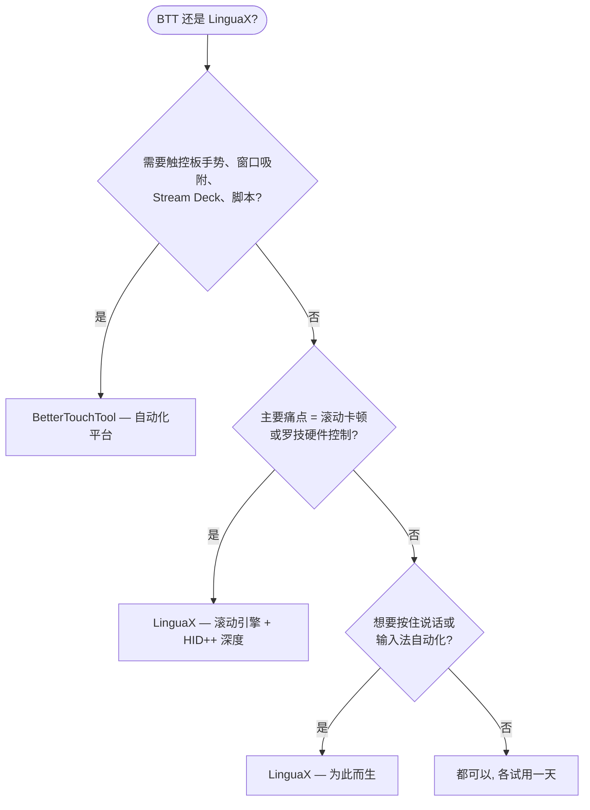

如果你在找 **BetterTouchTool 替代品**，诚实的答案取决于你到底用它做什么。BetterTouchTool 是 macOS 上的全家桶自动化平台——手势、键盘、Touch Bar、Stream Deck、窗口管理、脚本。如果这些你用到一半以上，它无可替代。但如果你来这只是为了**一件事——让第三方鼠标在 Mac 上好用**——LinguaX 是那个专注的工具：真正的平滑滚动引擎、罗技鼠标硬件深度控制、输入法自动切换，无需学习一个平台。

## BetterTouchTool 做得好的地方

BetterTouchTool 是 macOS 上能力最强的自动化应用之一：

- 触控板和 Magic Mouse 手势，外加鼠标按键和滚轮修饰键
- 窗口吸附与管理、键盘快捷键与 Hyper Key、浮动菜单
- 原生 Stream Deck 支持和 40+ 宏键盘设备（Logitech、Loupedeck、Razer 等）
- Spotlight 风格启动器、剪贴板管理器、截图工具、Touch Bar 自定义
- 深度脚本能力：JavaScript、AppleScript、`btt://` URL、内置 Web 服务器、CLI
- 45 天免费试用、无需账号；Standard 版 $15（含 2 年更新）、Lifetime 版 $25；也可通过 Setapp 订阅获取

以上均有据可查，来自 [BetterTouchTool 官网](https://folivora.ai/)。一份许可证覆盖你个人的所有 Mac。

## LinguaX 的不同之处

LinguaX 与 BTT 的鼠标部分重叠——按键映射、按应用配置、滚动方向——并恰好在这些地方做得更深，同时省掉了平台开销：

- **真正的平滑滚动引擎**：BTT 可以反转普通鼠标的滚动方向，但不会把一格一格的滚轮步进替换为阻尼曲线。LinguaX 会（Min Step / Speed Gain / Duration 三参数），并可按应用开关。
- **罗技鼠标硬件深度支持**：在受支持的型号上（MX Master 系列等）直接通过 HID++ 调节硬件 DPI、SmartShift、读取电量——无需 Logi Options+。
- **输入法自动切换**：按应用和网站域名自动切换 macOS 输入法——BTT 里没有对应能力。
- **为按住说话而生**：BTT 能把鼠标键映射到听写热键；LinguaX 的 Modifier Hold 是专为按住说话设计的——按住侧键、说话、松开。
- **专注**：一个小巧的原生应用做鼠标增强和输入自动化，而不是一个有几百个设置页的平台。

价格对比要诚实但有细节：LinguaX $9.9 一次买断、可激活 3 台 Mac、永久更新；BTT Standard $15 含 2 年更新，Lifetime $25——覆盖你所有个人 Mac。如果你真的用得上 BTT 的广度，它的定价其实很厚道。

## BetterTouchTool 与 LinguaX 对比（鼠标视角）

| 需求 | BetterTouchTool | LinguaX |
| --- | --- | --- |
| 定位 | 全家桶自动化平台 | 专注鼠标 + 输入法的工具 |
| 鼠标按键映射 | 支持 | 支持，含点击 / 双击 / 长按 / 方向拖拽手势 |
| 触控板 / Magic Mouse 手势 | 支持，核心强项 | 面向第三方鼠标 |
| 平滑滚动（阻尼曲线） | 滚动方向反转 | 支持，三参数调节，可按应用开关 |
| 罗技鼠标 DPI / SmartShift / 电量 | 非主打能力 | 支持，HID++ 直连（受支持型号） |
| 鼠标键按住说话 | 可映射热键实现 | 专为按住说话设计（Modifier Hold） |
| 输入法按应用/网站切换 | 不支持 | 支持 |
| 窗口吸附 / Stream Deck / Touch Bar | 支持 | 不支持 |
| 学习曲线 | 平台级 | 选个按键、指派动作 |
| 价格模式 | 45 天试用；$15 Standard / $25 Lifetime，全部个人 Mac；Setapp 渠道 | 30 天试用；$9.9 一次买断，3 台 Mac |

## 快速决策

## 什么情况下选 BetterTouchTool

- 你想要触控板 / Magic Mouse 手势、窗口吸附、Stream Deck 或脚本自动化
- 你享受搭建复杂自定义工作流，希望一个平台管所有事
- 你已经在用 Setapp
- 你希望一份许可覆盖所有个人 Mac

## 什么情况下选 LinguaX

- 你的唯一目标就是让第三方鼠标好用——不想要一个平台
- 滚轮一顿一顿是你最大的痛点——你要的是真正的平滑曲线
- 你用罗技鼠标，想在不装 Logi Options+ 的情况下调 DPI、SmartShift、看电量
- 你用多种语言输入，希望输入法跟随应用或网站域名自动切换
- 你想五分钟搞定，而不是配置一套自动化系统

## 用你自己的鼠标实测

两款应用都有免费试用（BTT 45 天、LinguaX 30 天），最可靠的比较方式是拿真实设备用一天：

1. 在两款应用里映射同一个侧键。
2. 在浏览器和长文档里对比滚动——这是功能差异最大的地方。
3. 如果你用罗技鼠标，看看 DPI / 电量控制对你是否重要。
4. 如果你用多种语言输入，在 LinguaX 里试试输入法自动化。

## 常见问题

**LinguaX 能直接替代 BetterTouchTool 吗？**
不能——它也不试图替代。LinguaX 用更深的实现替换 BTT 的鼠标部分（滚动引擎、罗技硬件控制、按住说话），并加上输入法自动化。要手势、窗口管理、Stream Deck 或脚本，BetterTouchTool 是这里唯一的答案。

**哪款应用的平滑滚动更好？**
LinguaX，没有悬念。BTT 提供普通鼠标的滚动方向反转；LinguaX 把步进式滚轮信号替换为连续的阻尼曲线，还能按应用区分。如果滚动手感是你的痛点，这就是全部关键。

**哪款应用更适合罗技鼠标？**
要硬件级特性——DPI、SmartShift、电量——选 LinguaX，它通过 HID++ 直连受支持型号。要从鼠标按键触发复杂宏，BTT 的自动化深度无人能及。

**如果我只需要鼠标功能，BTT 值得买吗？**
诚实地说，可能不值。BTT 的定价是为它的广度定的。如果你永远不会碰手势、Stream Deck 或脚本，专注的工具更便宜、配置也简单得多。

**应该先试哪一款？**
工具对准痛点。「我想自动化我的 Mac」→ BTT。「我想让鼠标好用」→ LinguaX。

## 开始使用

LinguaX 免费下载，**30 天全功能试用**——无需账号、零遥测。如果适合你的工作流，**$9.9 一次买断永久版，可激活 3 台 Mac**，无订阅。

**[下载 LinguaX](/download)**，用你真实的鼠标环境验证。

## 相关指南

- [Mouse+ — macOS 鼠标增强](/docs/mouse-plus/overview)
- [平滑滚动](/docs/mouse-plus/fundamentals/smooth-scrolling)
- [按键映射](/docs/mouse-plus/fundamentals/button-mapping)
- [SteerMouse 替代品](/docs/comparisons/steermouse-alternative-mac)
- [USB Overdrive 替代品](/docs/comparisons/usb-overdrive-alternative-mac)
