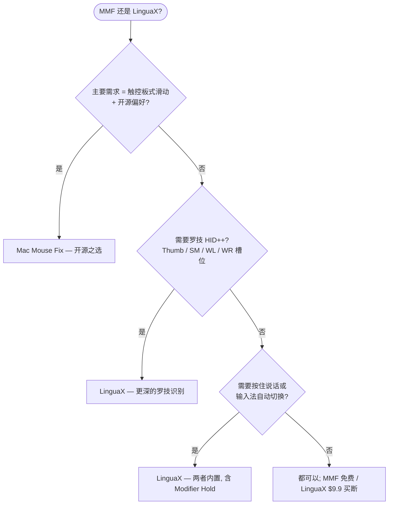

如果你在找 **Mac Mouse Fix 替代品**，先给你一个诚实的答案：Mac Mouse Fix 是一款优秀的 macOS 鼠标工具——价格实惠、开源，尤其擅长把触控板式手势带到普通鼠标上。而当你除了鼠标增强，还想要**按应用区分的行为、按住说话语音输入、罗技设备控制和输入法自动化**，并且希望一个原生应用全包时，LinguaX 更合适。

## Mac Mouse Fix 做得好的地方

Mac Mouse Fix 专注于让第三方鼠标更接近 Apple 触控板：

- Mission Control、App Exposé、切换桌面、Smart Zoom、前进/后退等触控板式手势
- 可选多档平滑度的平滑滚动
- 独立的鼠标滚动方向
- 鼠标动作与键盘快捷键触发
- 30 天免费试用和实惠的买断价格
- GitHub 上的开源代码

以上均有据可查，来自 [Mac Mouse Fix 官网](https://macmousefix.com/)和 [GitHub 仓库](https://github.com/noah-nuebling/mac-mouse-fix)。

## LinguaX 的不同之处

LinguaX 在基础部分——平滑滚动、按键映射、手势、按应用区分的行为——与之重叠，但设计目标是覆盖更完整的日常工作流：

- **Mouse+ 增强**：平滑滚动、侧键映射、点击 / 双击 / 长按 / 方向拖拽手势、指针速度、App 级覆盖
- **按住说话语音输入**：把鼠标侧键映射为按住 Fn/Globe，或触发语音应用的快捷键
- **罗技专属控制**：在受支持的设备上调节硬件 DPI、SmartShift、查看电量——无需 Logi Options+
- **输入法自动化**：按应用和网站域名自动切换 macOS 输入法
- **一个原生应用**搞定鼠标行为和输入自动化，无需堆叠多个工具

如果你只需要在普通 5 键鼠标上获得触控板式手势，Mac Mouse Fix 可能已经够用。如果你的工作流还涉及罗技硬件控制、语音输入、按应用配置或多语言输入，LinguaX 的覆盖面更广。

## Mac Mouse Fix 与 LinguaX 对比

| 需求 | Mac Mouse Fix | LinguaX |
| --- | --- | --- |
| 鼠标键触控板式手势 | 主力功能 | 通过鼠标手势与动作支持 |
| 平滑滚动 | 支持 | 支持，Min Step / Speed Gain / Duration 调节 |
| 鼠标滚动方向独立于触控板 | 支持 | 支持，垂直/水平分轴选择 |
| 鼠标键触发键盘快捷键 | 支持 | 支持 |
| 按应用区分的鼠标行为 | 支持 | 支持，App 级覆盖 |
| 罗技 DPI / SmartShift 控制 | 非主打能力 | 支持（受支持型号） |
| 鼠标电量显示 | 非主打能力 | 支持（BLE / 罗技连接受支持时） |
| 侧键按住说话 | 非主打能力 | 支持，Fn/Globe Modifier Hold 或快捷键映射 |
| 输入法按应用/网站切换 | 不支持 | 支持 |
| 开源 | 是 | 否 |
| 价格模式 | 30 天试用，实惠买断 | 30 天试用，$9.9 一次买断永久版，3 台 Mac |

## 快速决策

## 什么情况下选 Mac Mouse Fix

- 主要需求是鼠标键的触控板式手势
- 偏好开源软件
- 想要最便宜的专注型鼠标工具
- 你的鼠标按键在 Mac Mouse Fix 里能被正确识别
- 不需要输入法自动化、按住说话或罗技硬件控制

## 什么情况下选 LinguaX

- 希望鼠标增强和输入法自动化一个应用搞定
- 用罗技鼠标，想在受支持型号上获得应用内 DPI、SmartShift、电量显示
- 想把侧键映射为按住说话
- 需要在不同工作场景间按应用区分鼠标行为
- 用多种语言输入，希望输入法跟随应用或浏览器域名

## 设备兼容性说明

Mac Mouse Fix 官方说明：为 Logitech Options 这类专有驱动设计的鼠标可能有按键无法识别，且目前不支持 Apple Magic Mouse。LinguaX 同样不能承诺所有鼠标的所有高级功能：基础的平滑滚动和快捷键映射覆盖面很广，但 DPI、SmartShift、电量等硬件功能取决于设备支持路径。

可靠的比较方式是用你的实际鼠标测试一个工作日：

1. 在两款应用里映射同一个侧键。
2. 在浏览器、编辑器和一个滚动行为特殊的应用里测试平滑滚动。
3. 让 Mac 睡眠再唤醒，确认映射仍然生效。
4. 如果你用语音输入或多输入法，把这些流程也测一遍。

## 常见问题

**LinguaX 能直接替代 Mac Mouse Fix 吗？**
对于常见需求——平滑滚动、侧键映射、键盘快捷键、按应用区分的行为——可以。如果你特别看重 Mac Mouse Fix 的触控板手势模型或开源属性，Mac Mouse Fix 可能更适合。

**哪款应用更适合罗技鼠标？**
想要 DPI、SmartShift、电量显示等硬件功能，选 LinguaX。Mac Mouse Fix 也是优秀的鼠标工具，但罗技硬件控制不是它的主打方向。

**哪款应用更适合按住说话？**
LinguaX。内置 Fn/Globe 的 Modifier Hold，可以让侧键充当兼容听写工作流的按住说话触发器，也支持常规的键盘快捷键映射。

**应该先试哪一款？**
对准主要痛点。「我想在鼠标上用触控板式手势」→ Mac Mouse Fix。「我想要鼠标增强加语音和输入自动化一个应用全包」→ LinguaX。

## 开始使用

LinguaX 免费下载，**30 天全功能试用**——无需账号、零遥测。如果适合你的工作流，**$9.9 一次买断永久版，可激活 3 台 Mac**，无订阅。

**[下载 LinguaX](/download)**，用你真实的鼠标环境验证。

## 相关指南

- [Mouse+ — macOS 鼠标增强](/docs/mouse-plus/overview)
- [按键映射](/docs/mouse-plus/fundamentals/button-mapping)
- [手势映射](/docs/mouse-plus/fundamentals/gesture-mapping)
- [Mac 鼠标侧键映射方法](/docs/mouse-plus/recipes/map-mouse-side-buttons-macos)
- [BetterMouse 替代品](/docs/comparisons/bettermouse-alternative-mac)
- [Mos vs LinearMouse vs Mac Mouse Fix](/docs/comparisons/mos-vs-linearmouse-vs-mac-mouse-fix)
- [鼠标键按住说话语音输入](/docs/push-to-talk/push-to-talk-voice-typing-mac)
- [SteerMouse 替代品](/docs/comparisons/steermouse-alternative-mac)
- [USB Overdrive 替代品](/docs/comparisons/usb-overdrive-alternative-mac)
- [BetterTouchTool 替代品（鼠标场景）](/docs/comparisons/bettertouchtool-alternative-for-mouse-mac)
