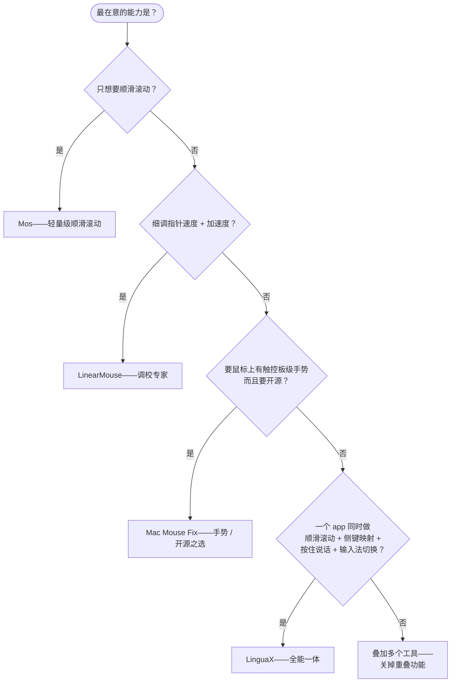

import Head from '@docusaurus/Head';

export const faqSchema = {
  '@context': 'https://schema.org',
  '@type': 'FAQPage',
  mainEntity: [
    {'@type': 'Question', name: 'Mos 免费而且顺滑滚动很好，为什么要换 LinguaX？', acceptedAnswer: {'@type': 'Answer', text: '如果只要滚动，Mos 没必要换。选 LinguaX 的场景是你同时还想要：手势、硬件级 DPI、电量、按 App 独立行为，或者按住鼠标侧键触发语音输入/输入法切换。Mos 覆盖不到这些。'}},
    {'@type': 'Question', name: '同时装 Mos + LinearMouse + Mac Mouse Fix 会打架吗？', acceptedAnswer: {'@type': 'Answer', text: '大概率会。三者都在拦鼠标事件，同一个滚轮 tick 可能被处理三次或者半途丢失，表现是掉帧、抖动、按键偶尔失灵。装多个的话建议只留一个鼠标增强工具，另两个只开非重叠功能，或者用 LinguaX 一次性替代。'}},
    {'@type': 'Question', name: 'LinguaX 支持罗技 MX Master 3S / 4 吗？不用 Logi Options+ 行不行？', acceptedAnswer: {'@type': 'Answer', text: '行。通过 BLE HID++ 完整支持手势和按键映射，不需要装 Logi Options+。'}},
    {'@type': 'Question', name: '非罗技鼠标能用吗？', acceptedAnswer: {'@type': 'Answer', text: '能。任何 USB / 蓝牙鼠标都能用，不需要驱动。罗技的常见型号（MX Master 系列、G502 X、M720、M585 等）额外有默认映射优化，其他品牌走通用识别。'}},
    {'@type': 'Question', name: 'LinguaX 的输入法自动切换是什么意思？', acceptedAnswer: {'@type': 'Answer', text: '按 App 或按网站的域名自动切换到指定的输入法/键盘布局——比如在 Xcode 里自动切英文键盘，回到微信/Slack 中文对话自动切中文。在 App 内的 Input Source 设置里配置规则，一次设定长期生效。'}}
  ]
};

<Head>
  
</Head>

# Mos vs LinearMouse vs Mac Mouse Fix vs LinguaX：Mac 鼠标增强工具怎么选

macOS 上能改善**第三方鼠标**手感的工具有好几个，但它们并不是同一类东西，功能重叠又不完全重合。**Mos** 是最经典的免费顺滑滚动工具；**LinearMouse** 主攻指针加速与每台设备独立调；**Mac Mouse Fix** 补上了手势与按键映射。问题是很多人最后同时装两三个——滚动一个、加速一个、手势一个——这正是掉帧和事件冲突的常见根源。本文诚实对比这四款 **Mac 鼠标增强工具**，同时说明 **LinguaX** 作为单一 app 的位置。

## 一眼看清四款工具

- **Mos**——免费开源。经典的顺滑滚动工具；2026 年的 4.x 版加入了鼠标按键绑定和罗技 HID++ 按键处理。仍然没有手势、没有 DPI 控制、没有输入法自动切换。
- **LinearMouse**——免费开源。专注指针速度/加速度和每台设备的独立调节，附带一些按键重映射。滚动平滑和手势不是它的强项。
- **Mac Mouse Fix**——价格亲民，手势与按键映射能力强，滚动平滑也不错。综合能力型选手。
- **LinguaX**——原生，约 10MB。一个 app 里做两件核心事：**鼠标增强**（平滑滚动、按键/手势映射、指针速度、分 App 覆盖）**加上**输入法自动切换。

## 功能对比表

| 能力 | Mos | LinearMouse | Mac Mouse Fix | LinguaX |
| --- | --- | --- | --- | --- |
| 平滑滚动 | 是（核心） | 有限 | 是 | 是——Min Step / Speed Gain / Duration |
| 反向滚动 | 是 | 是 | 是 | 是——分轴独立 |
| 指针速度 / 加速度 | 无 | 是（核心） | 有限 | 是——按设备保存 |
| 按键 / 侧键映射 | 是（4.x） | 部分 | 是 | 是 |
| 罗技 HID++ 按键 | 是（4.x） | 无 | 无 | 是 |
| 手势（滑动、长按） | 无 | 无 | 是 | 是 |
| DPI 调节（硬件级） | 无 | 无 | 无 | 是——罗技 HID++ |
| 电量显示 | 无 | 无 | 无 | 是——BLE / 罗技 HID++ |
| 分 App 覆盖 | 有限 | 部分 | 是 | 是 |
| 型号识别 | 仅罗技（HID++） | 部分 | 部分 | 广泛（MX Master、G502 X、M720、M585…） |
| 睡眠唤醒自动恢复 | 视情况 | 视情况 | 是 | 是 |
| 输入法自动切换 | 无 | 无 | 无 | 是（核心能力） |
| 能替代多工具堆栈 | 否 | 否 | 大部分 | 是——单一 app |
| 价格 | 免费 | 免费 | 一次性低价 | $9.9 一次性（3 台设备） |

## 怎么选：决策图

## 真正的选择：一个工具还是三个

只需要顺滑滚动，**Mos** 完全够用，还免费。只需要加速度调校，**LinearMouse** 也很好，同样免费。麻烦的是你**每一样都想要**——顺滑 **加** 加速度 **加** 手势 **加** 分 App 行为——同时装 Mos + LinearMouse + 一个按键重映射工具，意味着**三个 event tap 争同一份输入事件**，卡顿和丢击是常见后果。

**LinguaX** 就是给"这个槽位"设计的单一 app：

- 一条 event pipeline 同时处理滚动、速度、按键、手势——不会有跨工具冲突。
- 广泛的型号识别，每台设备都能对症配置。
- 分 App、分轴独立控制，免费工具通常只能全局。
- 一个免费工具没有的第二核心能力：**按 App / 按网站自动切换输入法**。

诚实结论：如果只要免费顺滑滚动加基本按键映射，Mos 或 LinearMouse 留着就好。如果想要**手势、硬件 DPI、电量显示、按设备的细调**都在一个原生 app 里——再加上一个输入法自动切换的加成能力——就选 LinguaX。

## 常见问题

### Mos 免费而且顺滑滚动很好，为什么要换 LinguaX？

如果只要滚动，Mos 没必要换。选 LinguaX 的场景是你**同时**还想要：手势、硬件级 DPI、电量、按 App 独立行为，或者按住鼠标侧键触发语音输入/输入法切换。Mos 覆盖不到这些。

### 同时装 Mos + LinearMouse + Mac Mouse Fix 会打架吗？

大概率会。三者都在拦鼠标事件，同一个滚轮 tick 可能被处理三次或者半途丢失，表现是**掉帧、抖动、按键偶尔失灵**。装多个的话建议只留一个鼠标增强工具，另两个只开非重叠功能，或者用 LinguaX 一次性替代。

### LinguaX 支持罗技 MX Master 3S / 4 吗？不用 Logi Options+ 行不行？

行。通过 BLE HID++ 完整支持手势和按键映射，不需要装 Logi Options+。相关型号页：[MX Master 4](/docs/mouse-plus/models/mx-master-4)、[MX Master 3S](/docs/mouse-plus/models/mx-master-3s)、[MX Anywhere 3S](/docs/mouse-plus/models/mx-anywhere-3s)。

### 非罗技鼠标能用吗？

能。任何 USB / 蓝牙鼠标都能用，不需要驱动。罗技的常见型号（MX Master 系列、G502 X、M720、M585 等）额外有默认映射优化，其他品牌走通用识别。

### LinguaX 的输入法自动切换是什么意思？

按 App 或按网站的域名自动切换到指定的输入法/键盘布局——比如在 Xcode 里自动切英文键盘，回到微信/Slack 中文对话自动切中文，去 Google Docs 特定文档自动切某个布局。在 App 内的 **Input Source** 设置里配置规则，一次设定长期生效。

## 开始使用

LinguaX 有 **30 天完整功能免费试用**，不需要注册。如果合用，是**一次性 9.9 美元、可授权 3 台设备**，没有订阅。

**[下载 LinguaX](/download)**——30 天免费试一把全能一体设置。

## 延伸阅读

- [Mac 鼠标侧键怎么映射：任意品牌鼠标教程](/zh-Hans/docs/mouse-plus/recipes/map-mouse-side-buttons-macos)
- [Mac 鼠标滚动卡顿？三方鼠标顺滑滚动的解决方法](/zh-Hans/docs/mouse-plus/recipes/fix-choppy-mouse-scrolling-macos)
- [Mac 按住说话语音输入（鼠标侧键触发）](/zh-Hans/docs/push-to-talk/push-to-talk-voice-typing-mac)
- [Mouse+ 概览](/docs/mouse-plus/overview)
- [Smooth Scrolling 详细配置](/docs/mouse-plus/fundamentals/smooth-scrolling)
- [Logi Options+ 替代方案（英文）](/docs/comparisons/logi-options-plus-alternative-macos)
- [BetterMouse 替代方案（英文）](/docs/comparisons/bettermouse-alternative-mac)
- [Mac Mouse Fix 替代方案（英文）](/docs/comparisons/mac-mouse-fix-alternative-macos)
