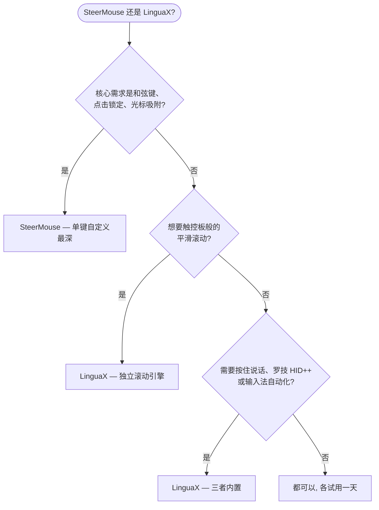

如果你在找 **SteerMouse 替代品**，先给你一个诚实的答案：SteerMouse 是 macOS 上最成熟的鼠标工具之一——由日本开发商 Plentycom 自 2005 年维护至今，按键自定义深度属于第一梯队。而当你除了按键映射，还想要**真正的平滑滚动引擎、按住说话语音输入、罗技硬件控制和输入法自动切换**时，LinguaX 是更合适的选择——而且价格更低。

## SteerMouse 做得好的地方

SteerMouse 专注于 USB 和蓝牙鼠标的深度驱动级自定义：

- 每个按键最多可分配 24 种功能，包括键盘快捷键、点击（双击、点击锁定）、缩放、应用切换器、Mission Control、系统与音乐控制、打开文件或网址
- 和弦键（chording）——按键与修饰键、或按键与按键的组合
- 光标调节超越 macOS 滑杆：跟踪速度之外还有独立的灵敏度控制，以及光标吸附（snapping）
- 滚动调节（加速度与灵敏度）和自动滚动
- 按应用单独配置
-「推荐设置」列表，可查看其他用户分享的配置排行
- 大版本内买断制——无订阅

以上均有据可查，来自 [SteerMouse 官网](https://plentycom.jp/en/steermouse/)的公开功能说明。SteerMouse 不支持 Apple Magic Mouse 和 Magic Trackpad，部分特殊按键可能无法识别——这些正是 LinguaX 的目标设备品类（第三方鼠标）。

## LinguaX 的不同之处

LinguaX 在按键映射、快捷键、按应用配置上与 SteerMouse 重叠，但设计目标是覆盖更完整的日常工作流：

- **真正的平滑滚动引擎**：SteerMouse 调节的是原生滚动事件的加速度与灵敏度；LinguaX 则把一格一格的滚轮步进替换为带阻尼的连续曲线（Min Step / Speed Gain / Duration 三参数），并可按应用开关。
- **按住说话语音输入**：按住鼠标侧键即可触发 macOS 听写、Wispr Flow 或 superwhisper（通过 Fn/Globe 长按或快捷键映射）。
- **罗技硬件控制**：在受支持的型号上直接调节硬件 DPI、SmartShift、查看电量——无需安装 Logi Options+。
- **输入法自动切换**：按应用和网站域名自动切换 macOS 输入法——完全在 SteerMouse 的功能范围之外。
- **价格与升级**：SteerMouse 5 售价 $19.99，大版本升级需付费（从 v4 升级 $12.99）。LinguaX $9.9 一次买断永久版，可激活 3 台 Mac，后续更新免费。

如果你的核心需求是极致的单键自定义深度——和弦键、点击锁定、光标吸附——SteerMouse 可能就是对口的工具。如果你的工作流还涉及平滑滚动、语音输入、罗技硬件特性或多语言输入，LinguaX 的覆盖面更广。

## SteerMouse 与 LinguaX 对比

| 需求 | SteerMouse | LinguaX |
| --- | --- | --- |
| 按键自定义深度 | 每键最多 24 种功能 | 点击 / 双击 / 长按 / 方向拖拽手势 |
| 和弦键（键+键组合） | 支持 | 非主打能力 |
| 光标速度/灵敏度调节 | 支持，另有光标吸附 | 支持，按设备记忆指针速度 |
| 平滑滚动（阻尼曲线） | 滚动加速度/灵敏度调节 | 支持，三参数调节，可按应用开关 |
| 鼠标滚轮方向独立于触控板 | 通过滚动设置实现 | 支持，垂直/水平分轴开关 |
| 按应用配置 | 支持 | 支持，App 级覆盖 |
| 罗技 DPI / SmartShift / 电量 | 非主打能力 | 支持（受支持型号） |
| 按住说话语音输入 | 不支持 | 支持 |
| 输入法按应用/网站切换 | 不支持 | 支持 |
| Magic Mouse / Trackpad 支持 | 不支持 | 面向第三方鼠标 |
| 价格模式 | 30 天试用，$19.99/大版本（升级付费） | 30 天试用，$9.9 一次买断，3 台 Mac |

## 快速决策

## 什么情况下选 SteerMouse

- 你依赖和弦键（按键+按键、按键+修饰键组合）
- 你需要点击锁定、光标吸附，或单个按键承载最多 24 种功能
- 你看重 20 年持续维护的历史积淀
- 你不需要平滑滚动、按住说话或输入法自动化

## 什么情况下选 LinguaX

- 滚轮一顿一顿是你最大的痛点——你要的是真正的平滑曲线，而不是更快的步进
- 你用罗技鼠标，想在不装 Logi Options+ 的情况下调 DPI、SmartShift、看电量
- 你想把侧键变成听写应用的按住说话键
- 你用多种语言输入，希望输入法跟随应用或网站域名自动切换
- 你想要买断后永久免费更新，不为大版本升级再次付费

## 用你自己的鼠标实测

两款应用都有 30 天免费试用，最可靠的比较方式是拿真实设备用一天：

1. 在两款应用里映射同一个侧键。
2. 在浏览器和长文档里对比滚动——这是两种设计哲学差异最大的地方。
3. 让 Mac 睡眠再唤醒，确认映射仍然生效。
4. 如果你用语音输入或多输入法，在 LinguaX 里把这两条流程也测一遍。

## 常见问题

**LinguaX 能直接替代 SteerMouse 吗？**
对于常见需求——按键映射、快捷键、按应用配置、滚动调节——可以。如果你明确依赖 SteerMouse 的和弦键、点击锁定或光标吸附，那目前只有 SteerMouse 提供这些能力。

**哪款应用的平滑滚动更好？**
LinguaX。SteerMouse 调节滚动加速度与灵敏度，改变的是原生步进式滚动的「快慢感」；LinguaX 则把步进替换为连续的阻尼曲线，更接近触控板。如果「滚动发跳」是你的痛点，这个差异就是全部关键。

**哪款应用更适合罗技鼠标？**
如果你想要 DPI、SmartShift、电量显示这类硬件特性，选 LinguaX。SteerMouse 在通用 HID 层面支持罗技鼠标，按键自定义也很出色，但罗技专属硬件控制不是它的目标。

**SteerMouse 还在维护吗？**
在维护——当前是第 5 代版本，许可证为大版本内买断，跨大版本升级需付费。自 2005 年以来持续更新至今。

**应该先试哪一款？**
哪个痛点最痛就先试哪个。如果痛点是「我需要复杂的按键组合」，先试 SteerMouse；如果痛点是「滚动太难用，而且我希望鼠标增强、语音输入、输入法自动化一个应用全包」，先试 LinguaX。

## 开始使用

LinguaX 免费下载，**30 天全功能试用**——无需账号、零遥测。如果适合你的工作流，**$9.9 一次买断永久版，可激活 3 台 Mac**，无订阅。

**[下载 LinguaX](/download)**，用你真实的鼠标环境验证。

## 相关指南

- [Mouse+ — macOS 鼠标增强](/docs/mouse-plus/overview)
- [平滑滚动](/docs/mouse-plus/fundamentals/smooth-scrolling)
- [按键映射](/docs/mouse-plus/fundamentals/button-mapping)
- [Mos vs LinearMouse vs Mac Mouse Fix](/docs/comparisons/mos-vs-linearmouse-vs-mac-mouse-fix)
- [Logi Options+ 替代品](/docs/comparisons/logi-options-plus-alternative-macos)
