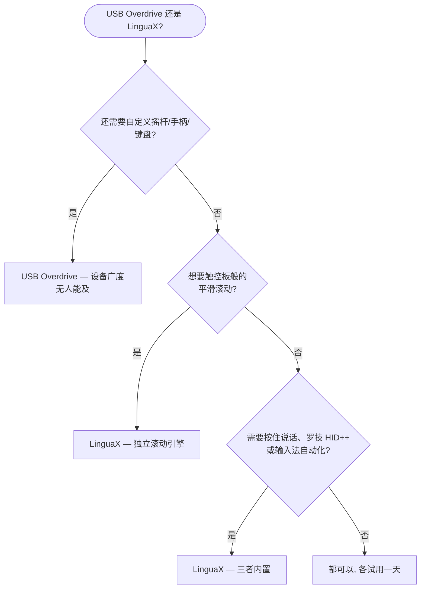

如果你在找 **USB Overdrive 替代品**，先给你一个诚实的答案：USB Overdrive 是 macOS 上的老牌工具——从 Mac OS 9 时代活到现在，设备覆盖面无人能及：鼠标、键盘、轨迹球、摇杆、游戏手柄，几乎任何厂商都行。而当你关注的就是**鼠标**，还想要**真正的平滑滚动引擎、按住说话语音输入、罗技硬件控制和输入法自动切换**时，LinguaX 更合适——价格只有一半。

## USB Overdrive 做得好的地方

USB Overdrive 专注于通用、驱动级的输入设备自定义：

- 支持 USB 和蓝牙的鼠标、键盘、轨迹球、摇杆、游戏手柄，几乎任何厂商——游戏控制器支持在这个品类里是稀缺能力
- 按设备、按应用的按键和轴分配
- 鼠标加速度与滚动速度自定义
- 分轴滚动反转、按住修饰键交换滚动轴（5.3 版新增）
- 超长 macOS 兼容记录——5.3.1 支持从 macOS 12 Monterey 到 macOS 26 Tahoe，旧版本一路回溯几十年
- 共享软件模式：试用**永不过期**；$20 注册费去除的是登录时和打开设置时的 10 秒提醒窗

以上均有据可查，来自 [USB Overdrive 官网](https://www.usboverdrive.com/)。和 LinguaX 一样，它刻意不支持 Apple 自家的鼠标、触控板和键盘——两款应用都是为第三方硬件而生。

## LinguaX 的不同之处

LinguaX 在鼠标的按键映射、按应用配置上与 USB Overdrive 重叠，但设计目标是覆盖更完整的日常工作流：

- **真正的平滑滚动引擎**：USB Overdrive 调节的是原生步进滚动的速度与加速度；LinguaX 把一格一格的滚轮步进替换为带阻尼的连续曲线（Min Step / Speed Gain / Duration 三参数），并可按应用开关。
- **按住说话语音输入**：按住鼠标侧键即可触发 macOS 听写、Wispr Flow 或 superwhisper。
- **罗技硬件控制**：在受支持的型号上直接调节硬件 DPI、SmartShift、查看电量——无需安装 Logi Options+。
- **输入法自动切换**：按应用和网站域名自动切换 macOS 输入法——完全在 USB Overdrive 的功能范围之外。
- **价格与试用方式**：USB Overdrive $20，试用永不过期但带提醒窗；LinguaX 提供干净的 30 天全功能试用，之后 $9.9 一次买断永久版，可激活 3 台 Mac，后续更新免费。

如果你需要在鼠标之外同时自定义摇杆、游戏手柄或键盘，USB Overdrive 的设备广度是 LinguaX 不去对标的能力。如果你的世界就是鼠标——还涉及平滑滚动、语音输入、罗技硬件特性或多语言输入——LinguaX 的覆盖面更广。

## USB Overdrive 与 LinguaX 对比

| 需求 | USB Overdrive | LinguaX |
| --- | --- | --- |
| 鼠标、键盘、轨迹球 | 支持 | 鼠标（任意 USB/蓝牙品牌） |
| 摇杆 / 游戏手柄 | 支持 | 不支持 |
| 按键自定义 | 按设备、按应用分配 | 点击 / 双击 / 长按 / 方向拖拽手势，App 级覆盖 |
| 平滑滚动（阻尼曲线） | 滚动速度/加速度调节 | 支持，三参数调节，可按应用开关 |
| 鼠标滚轮方向独立于触控板 | 分轴反转（5.3+） | 支持，垂直/水平分轴开关 |
| 按应用配置 | 支持 | 支持，App 级覆盖 |
| 罗技 DPI / SmartShift / 电量 | 非主打能力 | 支持（受支持型号） |
| 按住说话语音输入 | 不支持 | 支持 |
| 输入法按应用/网站切换 | 不支持 | 支持 |
| Apple 鼠标/触控板/键盘 | 不支持（刻意设计） | 面向第三方鼠标 |
| 价格模式 | $20 共享软件，无限试用带提醒窗 | 30 天试用，$9.9 一次买断，3 台 Mac |

## 快速决策

## 什么情况下选 USB Overdrive

- 你需要自定义的不只是鼠标——摇杆、游戏手柄、轨迹球、键盘都要管
- 你喜欢永不过期的共享软件试用，不介意提醒窗
- 你看重一路回溯到经典 Mac OS 时代的兼容记录
- 你不需要平滑滚动、按住说话或输入法自动化

## 什么情况下选 LinguaX

- 滚轮一顿一顿是你最大的痛点——你要的是真正的平滑曲线，而不是更快的步进
- 你用罗技鼠标，想在不装 Logi Options+ 的情况下调 DPI、SmartShift、看电量
- 你想把侧键变成听写应用的按住说话键
- 你用多种语言输入，希望输入法跟随应用或网站域名自动切换
- 你想要干净的 30 天试用和永久免费更新，价格只要一半

## 用你自己的鼠标实测

两款应用都可以免费试用，最可靠的比较方式是拿真实设备用一天：

1. 在两款应用里映射同一个侧键。
2. 在浏览器和长文档里对比滚动——这是两种设计哲学差异最大的地方。
3. 让 Mac 睡眠再唤醒，确认映射仍然生效。
4. 如果你用语音输入或多输入法，在 LinguaX 里把这两条流程也测一遍。

## 常见问题

**LinguaX 能直接替代 USB Overdrive 吗？**
对鼠标来说，大多数情况下可以——按键映射、按应用配置、滚动行为都覆盖了，而且往往更深。对键盘、轨迹球、摇杆、游戏手柄则不行：USB Overdrive 的设备广度无人能及，LinguaX 也不试图替代那部分。

**哪款应用的平滑滚动更好？**
LinguaX。USB Overdrive 调节滚动速度与加速度，改变的是原生步进式滚动的「快慢感」；LinguaX 则把步进替换为连续的阻尼曲线，更接近触控板。如果「滚动发跳」是你的痛点，这个差异就是全部关键。

**哪款应用更适合罗技鼠标？**
如果你想要 DPI、SmartShift、电量显示这类硬件特性，选 LinguaX。USB Overdrive 在通用 HID 层面支持罗技鼠标，但罗技专属硬件控制不是它的目标。

**USB Overdrive 还在维护吗？**
在维护——5.3.1 支持到最新的 macOS 26 Tahoe，5.3 版本还加入了分轴滚动反转。自经典 Mac OS 时代持续维护至今。

**应该先试哪一款？**
哪个痛点最痛就先试哪个。如果痛点是「我要管好几种输入设备」，先试 USB Overdrive；如果痛点是「滚动太难用，而且我希望鼠标增强、语音输入、输入法自动化一个应用全包」，先试 LinguaX。

## 开始使用

LinguaX 免费下载，**30 天全功能试用**——无需账号、零遥测。如果适合你的工作流，**$9.9 一次买断永久版，可激活 3 台 Mac**，无订阅。

**[下载 LinguaX](/download)**，用你真实的鼠标环境验证。

## 相关指南

- [Mouse+ — macOS 鼠标增强](/docs/mouse-plus/overview)
- [平滑滚动](/docs/mouse-plus/fundamentals/smooth-scrolling)
- [按键映射](/docs/mouse-plus/fundamentals/button-mapping)
- [SteerMouse 替代品](/docs/comparisons/steermouse-alternative-mac)
- [Logi Options+ 替代品](/docs/comparisons/logi-options-plus-alternative-macos)
