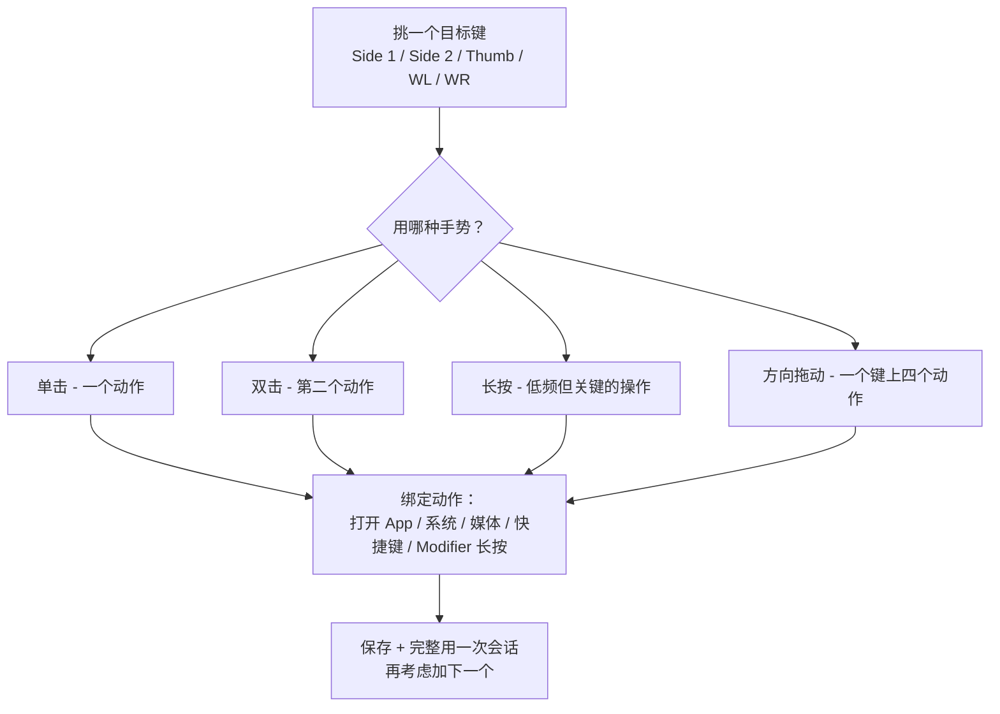

import ThemedImage from '@theme/ThemedImage';
import useBaseUrl from '@docusaurus/useBaseUrl';
import Head from '@docusaurus/Head';

export const faqSchema = {
  '@context': 'https://schema.org',
  '@type': 'FAQPage',
  mainEntity: [
    {'@type': 'Question', name: '任何品牌鼠标都能映射侧键吗？', acceptedAnswer: {'@type': 'Answer', text: '能。任何 USB 或蓝牙鼠标都能用，不需要驱动。已识别的罗技型号（MX Master 2S/3/3S、MX Anywhere 系列、G502 X、M720、M585 等）额外享受默认映射；未识别的鼠标手动逐键映射即可。'}},
    {'@type': 'Question', name: '为什么 Mac 上鼠标侧键默认什么都做不了？', acceptedAnswer: {'@type': 'Answer', text: 'macOS 系统设置里根本没有超出左右键 + 滚轮之外的按键设置项。厂商的官方 App（Logi Options+、Razer Synapse）能补上这一块，但通常要注册账号或者装一个常驻的重量级后台。LinguaX 这类原生工具直接在系统输入层做映射，不需要账号也不需要那些后台。'}},
    {'@type': 'Question', name: '要用 MX Master 系列，必须装 Logi Options+ 吗？', acceptedAnswer: {'@type': 'Answer', text: '不用。LinguaX 直接通过 BLE HID++ 和 MX Master 2S/3/3S/4 通信，可以映射所有按键，包括拇指键、长按、方向拖动这些手势。'}},
    {'@type': 'Question', name: '鼠标按键在 Mac 上能长按吗？', acceptedAnswer: {'@type': 'Answer', text: '侧键长按大多数鼠标都能用；拇指键长按目前只在通过 HID++ 通道连接的罗技型号上可用。单击、双击、方向拖动这些手势的适用范围更广。'}},
    {'@type': 'Question', name: '睡眠唤醒之后映射还在吗？', acceptedAnswer: {'@type': 'Answer', text: '在。蓝牙鼠标唤醒时会自动重连，关键输入服务会在系统唤醒时刷新，映射不需要重启 App 就能继续用。'}}
  ]
};

<Head>
  
</Head>

# Mac 鼠标侧键怎么映射：任意品牌鼠标（无需驱动、无需账号）

如果你把鼠标接到 Mac 上，会发现**侧键（拇指键、Side 1/2/3/4）什么都做不了**，或者只能触发一个固定动作、无法修改——因为 macOS 系统里根本没有给这些按键提供设置项。这篇是 **Mac 上映射鼠标侧键**的完整方法，覆盖**任意品牌鼠标**（罗技 MX Master、G502 X、M720、M585，以及非罗技鼠标），不需要驱动、不需要注册账号。LinguaX 是原生 macOS 工具（约 10MB），能把侧键、拇指键、滚轮左右倾按绑定到浏览器前进后退、Mission Control、媒体键、任意快捷键，甚至按住说话触发语音输入，还能分 App 独立配置。

## LinguaX 能映射哪些键

- **Side（侧键 1–4）** 和 **Thumb（拇指键）** ——识别到的型号自动出现
- **滚轮左右倾按（WL / WR）** ——设备支持时可用，默认触发水平滚动，只能绑定"点击"这一种手势
- 每个键支持的**手势**：单击、双击、**长按**、以及**方向拖动/滑动**（上/下/左/右）
- 可绑定的动作集：**系统预设**（Mission Control、切换 Space 等）、**媒体控制**、**键盘快捷键**、**Modifier 长按**、**打开 App**

LinguaX 自动识别常见型号（MX Master 系列、MX Anywhere、G502 X、M720、M585 等）并给出合理的默认映射，不识别的鼠标也能用（手动逐键映射）。**提示**：**拇指键长按**仅在通过 HID++ 通道连接的罗技机型上可用；单击/双击/方向拖动等手势适用范围更广。

## 设置步骤

1. 安装 LinguaX，首次运行时授予**辅助功能（Accessibility）**权限。
2. 打开 **Mouse+**，选中要映射的那个按键。
3. 选一个**手势**（先从单击开始）并绑定一个动作。
4. 保存后，先用完整的一次工作会话，别急着加更多映射。

<ThemedImage
  alt={"LinguaX 鼠标设置：选中 S1（侧键 1）并绑定一个「单击」动作"}
  sources={{
    light: useBaseUrl('/img/linguax-mouse-settings.png'),
    dark: useBaseUrl('/img/linguax-mouse-settings-dark.png'),
  }}
  width="420"
/>

## 推荐的映射顺序

1. 先挑一个**真正高频的动作**（浏览器后退、Mission Control、或某个 App 的快捷键）。
2. 只映射到一个侧键，用一次完整会话感受一下。
3. 直到第一个映射用起来完全自然，再加第二个。

侧键的**方向拖动**很强大：一个键最多能放四个方向的动作，拖动时屏幕上会实时提示当前指向哪个方向。

## 让映射保持稳定

- 别在一个键上叠太多动作（超过 3 个手势就很容易记混）
- 别在多个工具里给同一个键做重叠映射（会互相打架）
- **分 App 覆盖**只在真的需要不同行为的 App 上用，其他地方保持全局一致

**每支连接的鼠标独立保存自己的按键状态**，第二只鼠标不会继承第一只的映射，也不会冲突。

## 几个好用的第一映射

- 浏览器**后退 / 前进**
- **Mission Control** 或**切换 Space**
- 打开常用的**启动器 / 命令面板**
- 某个编辑器或设计工具里**高频重复的快捷键**

## 排错快速自查

- 确认**辅助功能（Accessibility）**权限已授予
- 检查没有别的工具在给同一个按键做重叠映射
- 先只测**一个按键 + 一个手势**，能用之后再加

## 常见问题

### 任何品牌鼠标都能映射侧键吗？

能。任何 **USB 或蓝牙鼠标**都能用，不需要驱动。已识别的罗技型号（MX Master 2S/3/3S、MX Anywhere 系列、G502 X、M720、M585 等）额外享受默认映射；未识别的鼠标手动逐键映射即可。

### 为什么 Mac 上鼠标侧键默认什么都做不了？

macOS 系统设置里根本**没有超出"左右键 + 滚轮"之外的按键设置项**。厂商的官方 App（Logi Options+、Razer Synapse）能补上这一块，但通常要**注册账号**或者**装一个常驻的重量级后台**。像 LinguaX 这类原生工具直接在系统输入层做映射，不需要账号也不需要那些后台。

### 要用 MX Master 系列，必须装 Logi Options+ 吗？

不用。LinguaX 直接通过 BLE HID++ 和 MX Master 2S/3/3S/4 通信，可以映射所有按键，包括**拇指键、长按、方向拖动**这些手势。详见 [MX Master 3S 无需 Logi Options+ 也能配置](/docs/comparisons/mx-master-3s-mac-setup-without-logi-options)。

### 鼠标按键在 Mac 上能长按吗？

**侧键长按**大多数鼠标都能用；**拇指键长按**目前只在通过 HID++ 通道连接的罗技型号上可用。单击、双击、方向拖动这些手势的适用范围更广。

### 睡眠唤醒之后映射还在吗？

在。蓝牙鼠标唤醒时会自动重连，关键输入服务会在系统唤醒时刷新，映射不需要重启 App 就能继续用。

## 开始使用

LinguaX 有 **30 天完整功能免费试用**，无需注册。合用的话，是**一次性 9.9 美元、可授权 3 台设备**，没有订阅。

**[下载 LinguaX](/download)**——30 天免费试一把侧键映射。

## 按型号看侧键布局

在配某一支具体的鼠标？下面这些型号页是这篇教程的延伸——每一页展示实际按键排布和 LinguaX 的映射方式：

- [MX Master 4](/docs/mouse-plus/models/mx-master-4) —— S1 / S2 / T / SM / WL / WR **再加**新增的 Actions Ring（`AR`）
- [MX Master 3S](/docs/mouse-plus/models/mx-master-3s) 与 [MX Master 3](/docs/mouse-plus/models/mx-master-3) —— 完整七位布局，含拇指滚轮
- [MX Anywhere 3S](/docs/mouse-plus/models/mx-anywhere-3s) / [MX Anywhere 3](/docs/mouse-plus/models/mx-anywhere-3) —— 便携尺寸，S1 / S2 为主
- [Logitech G Pro X Superlight 2](/docs/mouse-plus/models/logitech-g-pro-x-superlight-2) / [G Pro X Superlight](/docs/mouse-plus/models/logitech-g-pro-x-superlight) —— 电竞鼠标，Mac 下两个侧键
- [Logi Lift](/docs/mouse-plus/models/logitech-lift) —— 垂直人体工学布局
- [MX Ergo](/docs/mouse-plus/models/mx-ergo) —— 轨迹球，S1 / S2 可重映射

## 延伸阅读

- [Mac 按住说话语音输入（鼠标侧键触发）](/zh-Hans/docs/push-to-talk/push-to-talk-voice-typing-mac)
- [Mac 鼠标滚动卡顿？三方鼠标顺滑滚动的解决方法](/zh-Hans/docs/mouse-plus/recipes/fix-choppy-mouse-scrolling-macos)
- [Mac 鼠标增强对比：Mos vs LinearMouse vs Mac Mouse Fix](/zh-Hans/docs/comparisons/mos-vs-linearmouse-vs-mac-mouse-fix)
- [Mouse+ 概览](/docs/mouse-plus/overview)
- [按键映射详解（英文）](/docs/mouse-plus/fundamentals/button-mapping)
- [手势映射详解（英文）](/docs/mouse-plus/fundamentals/gesture-mapping)
