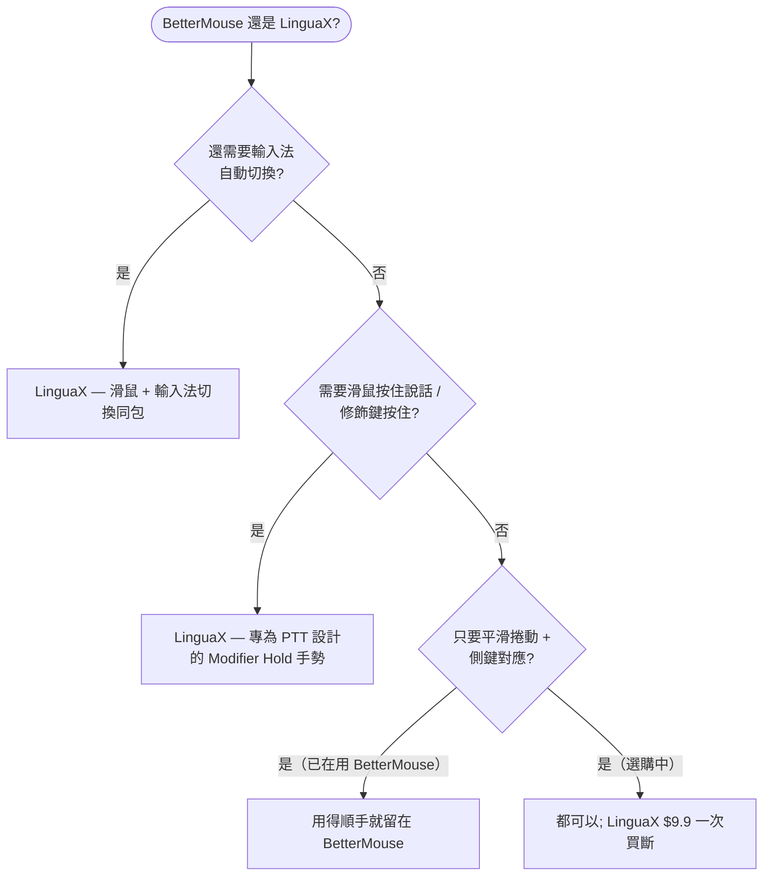

import Head from '@docusaurus/Head';

export const faqSchema = {
  '@context': 'https://schema.org',
  '@type': 'FAQPage',
  mainEntity: [
    {'@type': 'Question', name: 'Mac 上有免費的 BetterMouse 替代品嗎？', acceptedAnswer: {'@type': 'Answer', text: '沒有完全免費且功能與 BetterMouse 逐一對齊的產品。LinguaX 提供 30 天全功能免費試用——無需帳號或信用卡——之後 $9.9 一次買斷，可啟用 3 台裝置（無訂閱）。完全免費的開源選擇有 Mac Mouse Fix、Mos、LinearMouse，但各自覆蓋的範圍更窄。'}},
    {'@type': 'Question', name: 'BetterMouse 和 LinguaX 的價格對比？', acceptedAnswer: {'@type': 'Answer', text: '兩者都是買斷制（無訂閱）。LinguaX $9.9 終身版可啟用 3 台裝置，含 30 天免費試用。建議比較功能——平滑捲動調節、手勢種類、依應用程式覆寫、睡眠/喚醒穩定性——而不是只看價格，因為你每天付費買的是體驗。'}},
    {'@type': 'Question', name: 'BetterMouse 和 LinguaX 哪個更輕量？', acceptedAnswer: {'@type': 'Answer', text: '兩者都是原生 macOS 應用而非 Electron。LinguaX 約 10MB，以單一選單列應用運行，無帳號、無遙測。'}},
    {'@type': 'Question', name: '替代品支援 MX Master、G502 等羅技滑鼠嗎？', acceptedAnswer: {'@type': 'Answer', text: '支援。LinguaX 可識別 MX Master 2S/3/3S/4、MX Anywhere 2/2S/3/3S、G502 X、M720、M585 等型號，提供自動側鍵預設對應，受支援型號還可透過 BLE HID++ 顯示電量。'}},
    {'@type': 'Question', name: '對應在睡眠/喚醒後還在嗎？', acceptedAnswer: {'@type': 'Answer', text: '在。藍牙裝置在睡眠後自動重新連線，關鍵輸入服務在系統喚醒時刷新，捲動和對應的按鍵無需重新啟動應用即可繼續運作。'}}
  ]
};

<Head>
  
</Head>

# BetterMouse 替代品：Mac 版

如果你在找 **macOS 上的 BetterMouse 替代品**——無論是想要更輕、更便宜，還是帶免費試用的——篩選條件其實很簡單：給第三方滑鼠用上平滑捲動、可靠的側鍵對應和手勢，而不要廠商軟體那種臃腫。LinguaX 用原生約 10MB 的應用覆蓋同樣的需求，**$9.9 一次買斷**之前有 30 天免費試用，並且更進一步內建了**輸入法自動化**——一次安裝同時替代滑鼠工具和語言切換器。

## 人們對 BetterMouse 替代品的期待

- 適用於任何滾輪滑鼠的**平滑捲動**（不只是 Apple 觸控板）
- **側鍵與手勢對應**——前進/後退、Mission Control、應用快捷鍵
- **依應用程式區分的行為**——瀏覽器和編輯器可以有不同的捲動和對應
- **輕量原生的體積**，不在背景空轉

LinguaX 全部滿足。它可識別眾多型號（MX Master、MX Anywhere、G502 X、M720、M585 以及通用滑鼠），未識別的裝置也能用。

## BetterMouse 與 LinguaX 對比

| | LinguaX | BetterMouse |
| --- | --- | --- |
| 應用體積 | 約 10MB | 輕量原生 |
| 架構 | 原生 macOS | 原生 macOS |
| 平滑捲動 | Min Step / Speed Gain / Duration，依 App 開關 | 支援 |
| 按鍵與手勢對應 | 點擊 / 雙擊 / 長按 / 滑動，依 App 區分 | 支援 |
| 捲動反轉 | 分軸（水平/垂直獨立） | 全域式 |
| 睡眠/喚醒可靠性 | 喚醒時自動恢復 | 支援 |
| 輸入法自動化 | 內建——依應用程式/網站自動切換輸入法 | 不含 |
| 組合價值 | 滑鼠增強**加**輸入自動化一個應用搞定 | 僅滑鼠 |
| 支援 | 真人支援 | 真人支援 |
| 價格 | $9.9 一次買斷（3 台裝置） | 買斷制授權 |

## 選哪個 — 快速決策

## 「買一得二」的差異

BetterMouse 是專注的滑鼠工具。LinguaX 的主打也是滑鼠功能，但**輸入法自動化本身就是另一項核心能力**，不是綁在滑鼠引擎上的附屬品：它可以根據前台應用、甚至你所在的網站網域自動切換 macOS 輸入法。對任何用多種語言輸入的人——或者只是想讓正確的應用自動用對鍵盤配置的人——來說，這相當於不必另外購買、另外運行的第二個工具。

所以你得到的是：

- 一個真正輕量的原生滑鼠增強器。
- 加上依應用程式和瀏覽器 URL 的輸入法自動切換。
- 兩者都有真人直接支援，而不是工單排隊。

## 開始使用

LinguaX 免費下載，**30 天全功能試用**——無需帳號、零遙測。如果合適，**$9.9 一次買斷，可啟用 3 台裝置**（無訂閱）。

**[下載 LinguaX](/download)**，免費試用 30 天。

## 常見問題

### Mac 上有免費的 BetterMouse 替代品嗎？

沒有完全免費且功能逐一對齊的產品。LinguaX 提供 **30 天免費試用**——無需帳號或信用卡——之後 **$9.9 一次買斷，可啟用 3 台裝置**（無訂閱）。如果免費是硬性要求，最接近的開源選擇是 [Mac Mouse Fix](/docs/comparisons/mac-mouse-fix-alternative-macos)、Mos 和 LinearMouse——它們的取捨見 [Mos vs LinearMouse vs Mac Mouse Fix](/docs/comparisons/mos-vs-linearmouse-vs-mac-mouse-fix)。

### BetterMouse 和 LinguaX 的價格對比？

兩者都是買斷制（無訂閱）。LinguaX 是 **$9.9 終身版，可啟用 3 台裝置**，含 30 天免費試用。建議比較功能——平滑捲動調節、手勢種類、依應用程式覆寫、睡眠/喚醒穩定性——而不是只看價格，因為你付費買的是日常體驗。

### BetterMouse 和 LinguaX 哪個更輕量？

兩者都是原生 macOS 應用而非 Electron。LinguaX 約 **10MB**，以單一選單列應用運行，無帳號、無遙測。

### 替代品支援 MX Master、G502 等羅技滑鼠嗎？

支援。LinguaX 可識別 MX Master 2S/3/3S、MX Anywhere 2/2S/3/3S、G502 X、M720、M585 等型號，提供自動側鍵預設對應，受支援型號還可透過 BLE HID++ 顯示電量。另見[裝置相容性](/docs/mouse-plus/device-compatibility)和 [Mac 滑鼠側鍵對應方法](/docs/mouse-plus/recipes/map-mouse-side-buttons-macos)。

### 對應在睡眠/喚醒後還在嗎？

在。藍牙裝置在睡眠後自動重新連線，關鍵輸入服務在系統喚醒時刷新，捲動和對應的按鍵無需重新啟動應用即可繼續運作。

## 相關指南

- [Mouse+ — macOS 滑鼠增強](/docs/mouse-plus/overview)
- [平滑捲動](/docs/mouse-plus/fundamentals/smooth-scrolling)
- [按鍵與側鍵對應](/docs/mouse-plus/fundamentals/button-mapping)
- [Mac Mouse Fix 替代品](/docs/comparisons/mac-mouse-fix-alternative-macos)
- [輕量 Logi Options+ 替代品](/docs/comparisons/logi-options-plus-alternative-macos)
- [SteerMouse 替代品](/docs/comparisons/steermouse-alternative-mac)
- [USB Overdrive 替代品](/docs/comparisons/usb-overdrive-alternative-mac)
- [BetterTouchTool 替代品（滑鼠場景）](/docs/comparisons/bettertouchtool-alternative-for-mouse-mac)
