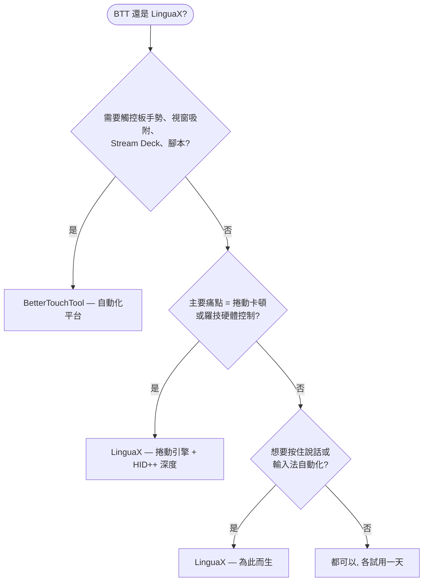

如果你在找 **BetterTouchTool 替代品**，誠實的答案取決於你到底用它做什麼。BetterTouchTool 是 macOS 上的全家桶自動化平台——手勢、鍵盤、Touch Bar、Stream Deck、視窗管理、腳本。如果這些你用到一半以上，它無可替代。但如果你來這裡只是為了**一件事——讓第三方滑鼠在 Mac 上好用**——LinguaX 是那個專注的工具：真正的平滑捲動引擎、羅技滑鼠硬體深度控制、輸入法自動切換，無需學習一個平台。

## BetterTouchTool 做得好的地方

BetterTouchTool 是 macOS 上能力最強的自動化應用之一：

- 觸控板和 Magic Mouse 手勢，外加滑鼠按鍵和滾輪修飾鍵
- 視窗吸附與管理、鍵盤快捷鍵與 Hyper Key、浮動選單
- 原生 Stream Deck 支援和 40+ 巨集鍵盤裝置（Logitech、Loupedeck、Razer 等）
- Spotlight 風格啟動器、剪貼簿管理器、截圖工具、Touch Bar 自訂
- 深度腳本能力：JavaScript、AppleScript、`btt://` URL、內建 Web 伺服器、CLI
- 45 天免費試用、無需帳號；Standard 版 $15（含 2 年更新）、Lifetime 版 $25；也可透過 Setapp 訂閱取得

以上均有據可查，來自 [BetterTouchTool 官網](https://folivora.ai/)。一份授權覆蓋你個人的所有 Mac。

## LinguaX 的不同之處

LinguaX 與 BTT 的滑鼠部分重疊——按鍵對應、依應用程式設定、捲動方向——並恰好在這些地方做得更深，同時省掉了平台開銷：

- **真正的平滑捲動引擎**：BTT 可以反轉普通滑鼠的捲動方向，但不會把一格一格的滾輪步進替換為阻尼曲線。LinguaX 會（Min Step / Speed Gain / Duration 三參數），並可依應用程式開關。
- **羅技滑鼠硬體深度支援**：在受支援的型號上（MX Master 系列等）直接透過 HID++ 調節硬體 DPI、SmartShift、讀取電量——無需 Logi Options+。
- **輸入法自動切換**：依應用程式和網站網域自動切換 macOS 輸入法——BTT 裡沒有對應能力。
- **為按住說話而生**：BTT 能把滑鼠鍵對應到聽寫熱鍵；LinguaX 的 Modifier Hold 是專為按住說話設計的——按住側鍵、說話、鬆開。
- **專注**：一個小巧的原生應用做滑鼠增強和輸入自動化，而不是一個有幾百個設定頁的平台。

價格對比要誠實但有細節：LinguaX $9.9 一次買斷、可啟用 3 台 Mac、永久更新；BTT Standard $15 含 2 年更新，Lifetime $25——覆蓋你所有個人 Mac。如果你真的用得上 BTT 的廣度，它的定價其實很厚道。

## BetterTouchTool 與 LinguaX 對比（滑鼠視角）

| 需求 | BetterTouchTool | LinguaX |
| --- | --- | --- |
| 定位 | 全家桶自動化平台 | 專注滑鼠 + 輸入法的工具 |
| 滑鼠按鍵對應 | 支援 | 支援，含點擊 / 雙擊 / 長按 / 方向拖曳手勢 |
| 觸控板 / Magic Mouse 手勢 | 支援，核心強項 | 面向第三方滑鼠 |
| 平滑捲動（阻尼曲線） | 捲動方向反轉 | 支援，三參數調節，可依 App 開關 |
| 羅技滑鼠 DPI / SmartShift / 電量 | 非主打能力 | 支援，HID++ 直連（受支援型號） |
| 滑鼠鍵按住說話 | 可對應熱鍵實現 | 專為按住說話設計（Modifier Hold） |
| 輸入法依應用程式/網站切換 | 不支援 | 支援 |
| 視窗吸附 / Stream Deck / Touch Bar | 支援 | 不支援 |
| 學習曲線 | 平台級 | 選個按鍵、指派動作 |
| 價格模式 | 45 天試用；$15 Standard / $25 Lifetime，全部個人 Mac；Setapp 管道 | 30 天試用；$9.9 一次買斷，3 台 Mac |

## 快速決策

## 什麼情況下選 BetterTouchTool

- 你想要觸控板 / Magic Mouse 手勢、視窗吸附、Stream Deck 或腳本自動化
- 你享受搭建複雜自訂工作流，希望一個平台管所有事
- 你已經在用 Setapp
- 你希望一份授權覆蓋所有個人 Mac

## 什麼情況下選 LinguaX

- 你的唯一目標就是讓第三方滑鼠好用——不想要一個平台
- 滾輪一頓一頓是你最大的痛點——你要的是真正的平滑曲線
- 你用羅技滑鼠，想在不裝 Logi Options+ 的情況下調 DPI、SmartShift、看電量
- 你用多種語言輸入，希望輸入法跟隨應用程式或網站網域自動切換
- 你想五分鐘搞定，而不是設定一套自動化系統

## 用你自己的滑鼠實測

兩款應用都有免費試用（BTT 45 天、LinguaX 30 天），最可靠的比較方式是拿真實裝置用一天：

1. 在兩款應用裡對應同一個側鍵。
2. 在瀏覽器和長文件裡對比捲動——這是功能差異最大的地方。
3. 如果你用羅技滑鼠，看看 DPI / 電量控制對你是否重要。
4. 如果你用多種語言輸入，在 LinguaX 裡試試輸入法自動化。

## 常見問題

**LinguaX 能直接替代 BetterTouchTool 嗎？**
不能——它也不試圖替代。LinguaX 用更深的實現替換 BTT 的滑鼠部分（捲動引擎、羅技硬體控制、按住說話），並加上輸入法自動化。要手勢、視窗管理、Stream Deck 或腳本，BetterTouchTool 是這裡唯一的答案。

**哪款應用的平滑捲動更好？**
LinguaX，沒有懸念。BTT 提供普通滑鼠的捲動方向反轉；LinguaX 把步進式滾輪訊號替換為連續的阻尼曲線，還能依應用程式區分。如果捲動手感是你的痛點，這就是全部關鍵。

**哪款應用更適合羅技滑鼠？**
要硬體級特性——DPI、SmartShift、電量——選 LinguaX，它透過 HID++ 直連受支援型號。要從滑鼠按鍵觸發複雜巨集，BTT 的自動化深度無人能及。

**如果我只需要滑鼠功能，BTT 值得買嗎？**
誠實地說，可能不值。BTT 的定價是為它的廣度定的。如果你永遠不會碰手勢、Stream Deck 或腳本，專注的工具更便宜、設定也簡單得多。

**應該先試哪一款？**
工具對準痛點。「我想自動化我的 Mac」→ BTT。「我想讓滑鼠好用」→ LinguaX。

## 開始使用

LinguaX 免費下載，**30 天全功能試用**——無需帳號、零遙測。如果適合你的工作流，**$9.9 一次買斷終身版，可啟用 3 台 Mac**，無訂閱。

**[下載 LinguaX](/download)**，用你真實的滑鼠環境驗證。

## 相關指南

- [Mouse+ — macOS 滑鼠增強](/docs/mouse-plus/overview)
- [平滑捲動](/docs/mouse-plus/fundamentals/smooth-scrolling)
- [按鍵對應](/docs/mouse-plus/fundamentals/button-mapping)
- [SteerMouse 替代品](/docs/comparisons/steermouse-alternative-mac)
- [USB Overdrive 替代品](/docs/comparisons/usb-overdrive-alternative-mac)
