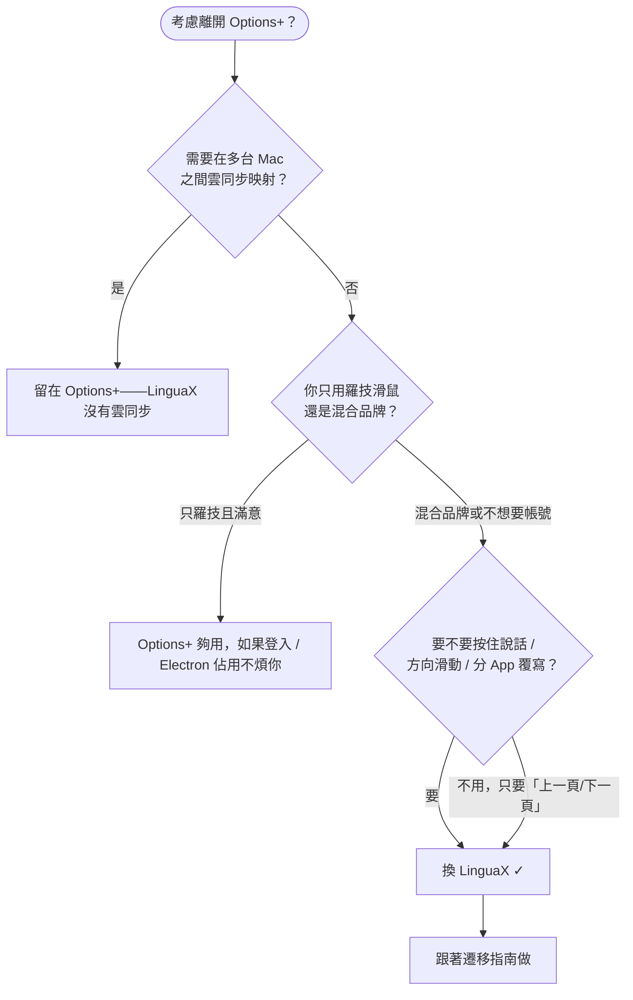

import Head from '@docusaurus/Head';

export const faqSchema = {
  '@context': 'https://schema.org',
  '@type': 'FAQPage',
  mainEntity: [
    {'@type': 'Question', name: '有不用註冊帳號的 Logi Options+ 替代品嗎？', acceptedAnswer: {'@type': 'Answer', text: '有。LinguaX 無帳號、無遙測——平滑捲動、按鍵/手勢映射這些核心功能開箱即用。帳號強制是很多人離開 Logi Options+ 的主要原因，一款好的替代品不應該再把這一層加回來。'}},
    {'@type': 'Question', name: '非羅技滑鼠能用嗎，還是只支援羅技？', acceptedAnswer: {'@type': 'Answer', text: '任何 USB 或藍牙滑鼠都能用，不需要驅動。羅技型號（MX Master 2S/3/3S/4、MX Anywhere 2/2S/3/3S、G502 X、M720、M585 等）另外享受更強的識別和自動側鍵預設映射。'}},
    {'@type': 'Question', name: '睡眠喚醒和藍牙重連後映射還在嗎？', acceptedAnswer: {'@type': 'Answer', text: '在。藍牙滑鼠喚醒後自動重新連線，LinguaX 會在喚醒時重新整理權限和關鍵服務。這正是「一天測試協議」第 4 步專門檢查的失敗模式。'}},
    {'@type': 'Question', name: '和 BetterMouse / Mos / LinearMouse 有什麼區別？', acceptedAnswer: {'@type': 'Answer', text: '各家側重點不同——有的只做平滑捲動、有的只做按鍵重映射。LinguaX 是唯一在一個原生 app 裡同時做平滑捲動 + 按鍵/手勢映射 + 分 App 覆寫 + 輸入法自動切換的，可以避免多工具的 event tap 衝突。'}},
    {'@type': 'Question', name: 'MX Master 3S / 4 不裝 Logi Options+ 也能設定嗎？', acceptedAnswer: {'@type': 'Answer', text: '能。LinguaX 透過 BLE HID++ 完整支援所有按鍵和手勢映射，不需要裝 Logi Options+。'}},
    {'@type': 'Question', name: 'G Pro X Superlight 不裝 G HUB 也能在 Mac 上用嗎？', acceptedAnswer: {'@type': 'Answer', text: '能。LinguaX 透過通用 HID 引擎在 macOS 上映射它的兩個側鍵，不需要裝 G HUB，也不需要驅動。'}},
    {'@type': 'Question', name: '多少錢？', acceptedAnswer: {'@type': 'Answer', text: 'LinguaX 是一次性 9.9 美元買斷，可授權 3 台裝置，有 30 天完整功能免費試用。無訂閱、無帳號。'}}
  ]
};

<Head>
  
</Head>

# Logi Options+ Mac 替代品：輕量、無需帳號、支援任何滑鼠

如果你在搜 **Logi Options+ 的 Mac 替代品**，多半是因為這三件事之一：一個常駐後台還佔幾百 MB 的重量級 app、開始映射一顆按鍵之前要求先登入帳號、或者一款只支援羅技硬體的工具。LinguaX 是一個原生、輕量的 Mac 滑鼠增強工具，只做你每天真的用到的那部分——**平滑捲動和側鍵映射**——而且支援**任何品牌**的滑鼠。

## 為什麼大家要換 Logi Options+

- **它太重。** Logi Options+ 是一個 Electron 應用程式，日常只做按鍵映射和捲動這兩件事，卻常駐幾百 MB 的後台程序。
- **它要帳號。** 很多工作流被登入門檻和「你從來沒要求的」線上同步擋在門外。
- **它只認羅技。** 如果你手上是混合品牌，或者只有一隻非羅技滑鼠，它完全幫不上忙。
- **睡眠喚醒 / macOS 升級後可能失靈。** 捲動或按鍵停止回應，得手動切換或重新連線。

如果你只是想要穩定的捲動 + 幾個按鍵映射，這套代價太大。

## LinguaX 怎麼解決

LinguaX 是 **mouse-first**、原生為 macOS 建構：

- **~10MB、原生——不是 Electron。** 不會為了重映射一顆按鍵去啟動一整個瀏覽器 runtime。
- **無帳號、無遙測。** 本機設定，開箱就做事，不需要登入任何東西。
- **任何品牌的滑鼠都能用。** 識別廣泛的機型（含 Logitech MX Master、MX Anywhere、G502 X、M720、M585，以及通用滑鼠），不認識的裝置也照樣工作。
- **平滑捲動帶細粒度控制**——Min Step、Speed Gain、Duration，加上**分 App 開關**。只作用在滑鼠滾輪，不動觸控板。
- **側鍵和手勢映射**——單擊、雙擊、長按、方向滑動——支援分 App 覆寫。
- **睡眠喚醒後可靠。** 藍牙裝置喚醒自動重連，關鍵服務在系統喚醒時重新整理。

## LinguaX vs Logi Options+

| | LinguaX | Logi Options+ |
| --- | --- | --- |
| App 體積 | ~10MB | 幾百 MB |
| 架構 | 原生 macOS | Electron |
| 需要帳號 | 不需要 | 經常需要 |
| 滑鼠品牌支援 | 任何品牌（識別廣泛） | 僅羅技 |
| 平滑捲動 | 是——Min Step / Speed Gain / Duration，分 App 開關 | 有限 |
| 睡眠喚醒可靠性 | 自動恢復 | 可能要重連 |
| 遙測 | 無 | 有線上帳號 / 同步 |
| 價格 | $9.9 一次性（3 台裝置） | 免費，僅限羅技 |

## 該換 Logi Options+ 嗎？快速決策

:::tip 想讓 Options+ 繼續管硬體設定？
如果你想讓 LinguaX 負責按鍵映射，同時讓 Options+ 繼續管理裝置級的 DPI / SmartShift / 背光，不需要把 Options+ 解除安裝。把 Options+ 的**輸入監控（Input Monitoring）**權限撤銷即可——詳見[排查滑鼠工具衝突](/docs/troubleshooting/conflicts-with-other-tools)。
:::

## 一天測試協議

一款 Logi Options+ 替代品是否真的能撐住日常使用，最快的驗證方式是走完一個刻意設計的完整工作日。測這四件事，就能判斷：

1. **長時間瀏覽器閱讀。** 刷幾篇長文。判斷標準：是否順滑、是否會抖或者過衝？調一下捲動滑桿（Min Step、Speed Gain、Duration），確認三個滑桿各自有不同的效果。
2. **編輯器 + 終端切換。** 在程式碼編輯器和終端之間來回真實工作。判斷標準：捲動在編輯器裡是否精準、在瀏覽器裡是否順滑？如果每個 App 有自己的行為，說明分 App 覆寫是真的。
3. **兩個側鍵動作。** 映射一個高頻動作（上一頁/下一頁）和一個手勢動作（長按 → Mission Control，或滑動 → 切換 Space）。判斷標準：一小時正常使用裡兩個都穩定觸發，包括切換 App 之後？
4. **一次睡眠喚醒循環。** 讓 Mac 睡眠、喚醒，然後立即捲動 + 點擊已映射的按鍵。判斷標準：所有功能都無需重啟就工作？藍牙滑鼠是否無需手動重連就恢復？

四件事都通過，日常使用就沒問題。**第 4 步是絕大多數廠商套件和輕量工具悄悄失靈的地方。**

## 開始使用

LinguaX 是免費下載，含 **30 天試用**——無帳號、無遙測。合用的話，是**一次性 9.9 美元、可授權 3 台裝置**（無訂閱）。

**[下載 LinguaX](/download)** 免費試用 30 天。

## 常見問題

### 有不用註冊帳號的 Logi Options+ 替代品嗎？

有。LinguaX 無帳號、無遙測——平滑捲動、按鍵/手勢映射這些核心功能開箱即用。帳號強制是很多人離開 Logi Options+ 的主要原因，一款好的替代品不應該再把這一層加回來。

### 非羅技滑鼠能用嗎，還是只支援羅技？

任何 USB 或藍牙滑鼠都能用，不需要驅動。羅技型號（MX Master 2S/3/3S/4、MX Anywhere 2/2S/3/3S、G502 X、M720、M585 等）另外享受更強的識別和自動側鍵預設映射。詳見[裝置相容性](/docs/mouse-plus/device-compatibility)。

### 睡眠喚醒和藍牙重連後映射還在嗎？

在。藍牙滑鼠喚醒後自動重新連線，LinguaX 會在喚醒時重新整理權限和關鍵服務。這正是「一天測試協議」第 4 步專門檢查的失敗模式。

### 和 BetterMouse、Mos、LinearMouse 有什麼區別？

各家側重不同——有的只做平滑捲動、有的只做按鍵重映射。LinguaX 是唯一在一個原生 app 裡同時做平滑捲動 + 按鍵/手勢映射 + 分 App 覆寫 + 輸入法自動切換的，可以避免多工具的 event tap 衝突。詳見[Mos vs LinearMouse vs Mac Mouse Fix 對比](/zh-Hant/docs/comparisons/mos-vs-linearmouse-vs-mac-mouse-fix)。

### MX Master 3S / 4 不裝 Logi Options+ 也能設定嗎？

能。LinguaX 透過 BLE HID++ 完整支援所有按鍵和手勢映射，不需要裝 Logi Options+。相關型號頁：[MX Master 4](/docs/mouse-plus/models/mx-master-4)、[MX Master 3](/docs/mouse-plus/models/mx-master-3)、[MX Anywhere 3S](/docs/mouse-plus/models/mx-anywhere-3s)、[MX Anywhere 3](/docs/mouse-plus/models/mx-anywhere-3)、[Logi Lift](/docs/mouse-plus/models/logitech-lift)、[MX Ergo](/docs/mouse-plus/models/mx-ergo)。

### G Pro X Superlight 不裝 G HUB 也能在 Mac 上用嗎？

能。LinguaX 透過通用 HID 引擎在 macOS 上映射它的兩個側鍵，不需要裝 G HUB，也不需要驅動。相關型號頁：[G Pro X Superlight](/docs/mouse-plus/models/logitech-g-pro-x-superlight)、[G Pro X Superlight 2](/docs/mouse-plus/models/logitech-g-pro-x-superlight-2)。

### 多少錢？

LinguaX 是**一次性 9.9 美元買斷**，可授權 3 台裝置，有 **30 天完整功能免費試用**——無訂閱、無帳號。

## 延伸閱讀

- [Mac 滑鼠增強對比：Mos vs LinearMouse vs Mac Mouse Fix](/zh-Hant/docs/comparisons/mos-vs-linearmouse-vs-mac-mouse-fix)
- [Mac 滑鼠側鍵怎麼映射：任意品牌滑鼠教程](/zh-Hant/docs/mouse-plus/recipes/map-mouse-side-buttons-macos)
- [Mac 滑鼠捲動卡頓？三方滑鼠順滑捲動的解決方法](/zh-Hant/docs/mouse-plus/recipes/fix-choppy-mouse-scrolling-macos)
- [Mac 按住說話語音輸入（滑鼠側鍵觸發）](/zh-Hant/docs/push-to-talk/push-to-talk-voice-typing-mac)
- [Mouse+ 概覽](/docs/mouse-plus/overview)
- [排查滑鼠工具衝突](/docs/troubleshooting/conflicts-with-other-tools)
