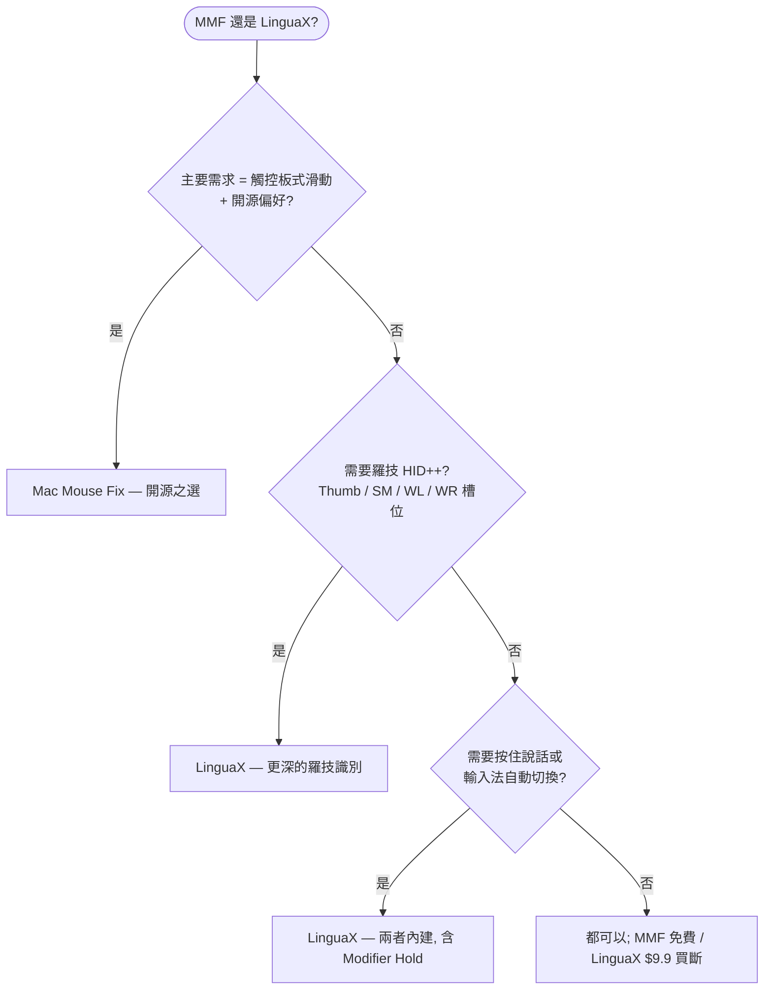

如果你在找 **Mac Mouse Fix 替代品**，先給你一個誠實的答案：Mac Mouse Fix 是一款優秀的 macOS 滑鼠工具——價格實惠、開源，尤其擅長把觸控板式手勢帶到普通滑鼠上。而當你除了滑鼠增強，還想要**依應用程式區分的行為、按住說話語音輸入、羅技裝置控制和輸入法自動化**，並且希望一個原生應用全包時，LinguaX 更合適。

## Mac Mouse Fix 做得好的地方

Mac Mouse Fix 專注於讓第三方滑鼠更接近 Apple 觸控板：

- Mission Control、App Exposé、切換桌面、Smart Zoom、前進/後退等觸控板式手勢
- 可選多檔平滑度的平滑捲動
- 獨立的滑鼠捲動方向
- 滑鼠動作與鍵盤快捷鍵觸發
- 30 天免費試用和實惠的買斷價格
- GitHub 上的開源程式碼

以上均有據可查，來自 [Mac Mouse Fix 官網](https://macmousefix.com/)和 [GitHub 儲存庫](https://github.com/noah-nuebling/mac-mouse-fix)。

## LinguaX 的不同之處

LinguaX 在基礎部分——平滑捲動、按鍵對應、手勢、依應用程式區分的行為——與之重疊，但設計目標是覆蓋更完整的日常工作流：

- **Mouse+ 增強**：平滑捲動、側鍵對應、點擊 / 雙擊 / 長按 / 方向拖曳手勢、指標速度、App 級覆寫
- **按住說話語音輸入**：把滑鼠側鍵對應為按住 Fn/Globe，或觸發語音應用的快捷鍵
- **羅技專屬控制**：在受支援的裝置上調節硬體 DPI、SmartShift、查看電量——無需 Logi Options+
- **輸入法自動化**：依應用程式和網站網域自動切換 macOS 輸入法
- **一個原生應用**搞定滑鼠行為和輸入自動化，無需堆疊多個工具

如果你只需要在普通 5 鍵滑鼠上獲得觸控板式手勢，Mac Mouse Fix 可能已經夠用。如果你的工作流還涉及羅技硬體控制、語音輸入、依應用程式設定或多語言輸入，LinguaX 的覆蓋面更廣。

## Mac Mouse Fix 與 LinguaX 對比

| 需求 | Mac Mouse Fix | LinguaX |
| --- | --- | --- |
| 滑鼠鍵觸控板式手勢 | 主力功能 | 透過滑鼠手勢與動作支援 |
| 平滑捲動 | 支援 | 支援，Min Step / Speed Gain / Duration 調節 |
| 滑鼠捲動方向獨立於觸控板 | 支援 | 支援，垂直/水平分軸選擇 |
| 滑鼠鍵觸發鍵盤快捷鍵 | 支援 | 支援 |
| 依應用程式區分的滑鼠行為 | 支援 | 支援，App 級覆寫 |
| 羅技 DPI / SmartShift 控制 | 非主打能力 | 支援（受支援型號） |
| 滑鼠電量顯示 | 非主打能力 | 支援（BLE / 羅技連接受支援時） |
| 側鍵按住說話 | 非主打能力 | 支援，Fn/Globe Modifier Hold 或快捷鍵對應 |
| 輸入法依應用程式/網站切換 | 不支援 | 支援 |
| 開源 | 是 | 否 |
| 價格模式 | 30 天試用，實惠買斷 | 30 天試用，$9.9 一次買斷終身版，3 台 Mac |

## 快速決策

## 什麼情況下選 Mac Mouse Fix

- 主要需求是滑鼠鍵的觸控板式手勢
- 偏好開源軟體
- 想要最便宜的專注型滑鼠工具
- 你的滑鼠按鍵在 Mac Mouse Fix 裡能被正確識別
- 不需要輸入法自動化、按住說話或羅技硬體控制

## 什麼情況下選 LinguaX

- 希望滑鼠增強和輸入法自動化一個應用搞定
- 用羅技滑鼠，想在受支援型號上獲得應用內 DPI、SmartShift、電量顯示
- 想把側鍵對應為按住說話
- 需要在不同工作場景間依應用程式區分滑鼠行為
- 用多種語言輸入，希望輸入法跟隨應用程式或瀏覽器網域

## 裝置相容性說明

Mac Mouse Fix 官方說明：為 Logitech Options 這類專有驅動設計的滑鼠可能有按鍵無法識別，且目前不支援 Apple Magic Mouse。LinguaX 同樣不能承諾所有滑鼠的所有進階功能：基礎的平滑捲動和快捷鍵對應覆蓋面很廣，但 DPI、SmartShift、電量等硬體功能取決於裝置支援路徑。

可靠的比較方式是用你的實際滑鼠測試一個工作日：

1. 在兩款應用裡對應同一個側鍵。
2. 在瀏覽器、編輯器和一個捲動行為特殊的應用裡測試平滑捲動。
3. 讓 Mac 睡眠再喚醒，確認對應仍然生效。
4. 如果你用語音輸入或多輸入法，把這些流程也測一遍。

## 常見問題

**LinguaX 能直接替代 Mac Mouse Fix 嗎？**
對於常見需求——平滑捲動、側鍵對應、鍵盤快捷鍵、依應用程式區分的行為——可以。如果你特別看重 Mac Mouse Fix 的觸控板手勢模型或開源屬性，Mac Mouse Fix 可能更適合。

**哪款應用更適合羅技滑鼠？**
想要 DPI、SmartShift、電量顯示等硬體功能，選 LinguaX。Mac Mouse Fix 也是優秀的滑鼠工具，但羅技硬體控制不是它的主打方向。

**哪款應用更適合按住說話？**
LinguaX。內建 Fn/Globe 的 Modifier Hold，可以讓側鍵充當相容聽寫工作流的按住說話觸發器，也支援常規的鍵盤快捷鍵對應。

**應該先試哪一款？**
對準主要痛點。「我想在滑鼠上用觸控板式手勢」→ Mac Mouse Fix。「我想要滑鼠增強加語音和輸入自動化一個應用全包」→ LinguaX。

## 開始使用

LinguaX 免費下載，**30 天全功能試用**——無需帳號、零遙測。如果適合你的工作流，**$9.9 一次買斷終身版，可啟用 3 台 Mac**，無訂閱。

**[下載 LinguaX](/download)**，用你真實的滑鼠環境驗證。

## 相關指南

- [Mouse+ — macOS 滑鼠增強](/docs/mouse-plus/overview)
- [按鍵對應](/docs/mouse-plus/fundamentals/button-mapping)
- [手勢對應](/docs/mouse-plus/fundamentals/gesture-mapping)
- [Mac 滑鼠側鍵對應方法](/docs/mouse-plus/recipes/map-mouse-side-buttons-macos)
- [BetterMouse 替代品](/docs/comparisons/bettermouse-alternative-mac)
- [Mos vs LinearMouse vs Mac Mouse Fix](/docs/comparisons/mos-vs-linearmouse-vs-mac-mouse-fix)
- [滑鼠鍵按住說話語音輸入](/docs/push-to-talk/push-to-talk-voice-typing-mac)
- [SteerMouse 替代品](/docs/comparisons/steermouse-alternative-mac)
- [USB Overdrive 替代品](/docs/comparisons/usb-overdrive-alternative-mac)
- [BetterTouchTool 替代品（滑鼠場景）](/docs/comparisons/bettertouchtool-alternative-for-mouse-mac)
