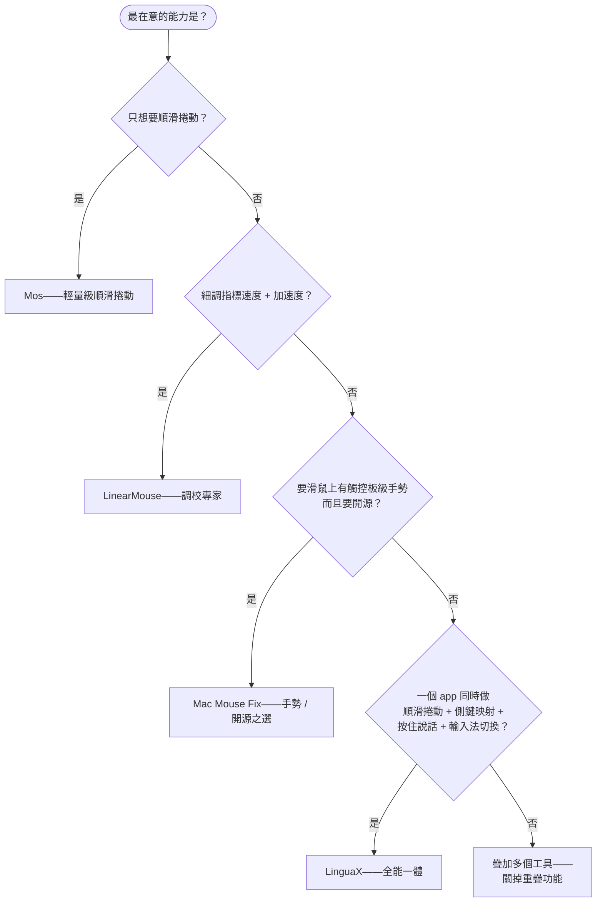

# Mos vs LinearMouse vs Mac Mouse Fix vs LinguaX：Mac 滑鼠增強工具怎麼選

macOS 上能改善**第三方滑鼠**手感的工具有好幾個，但它們並不是同一類東西，功能重疊又不完全重合。**Mos** 是最經典的免費順滑捲動工具；**LinearMouse** 主攻指標加速與每台裝置獨立調；**Mac Mouse Fix** 補上了手勢與按鍵映射。問題是很多人最後同時裝兩三個——捲動一個、加速一個、手勢一個——這正是掉幀和事件衝突的常見根源。本文誠實對比這四款 **Mac 滑鼠增強工具**，同時說明 **LinguaX** 作為單一應用程式的位置。

## 一眼看清四款工具

- **Mos**——免費開源。經典的順滑捲動工具；2026 年的 4.x 版加入了滑鼠按鍵綁定和羅技 HID++ 按鍵處理。仍然沒有手勢、沒有 DPI 控制、沒有輸入法自動切換。
- **LinearMouse**——免費開源。專注指標速度/加速度和每台裝置的獨立調節，附帶一些按鍵重映射。捲動平滑和手勢不是它的強項。
- **Mac Mouse Fix**——價格親民，手勢與按鍵映射能力強，捲動平滑也不錯。綜合能力型選手。
- **LinguaX**——原生，約 10MB。一個 app 裡做兩件核心事：**滑鼠增強**（平滑捲動、按鍵/手勢映射、指標速度、分 App 覆寫）**加上**輸入法自動切換。

## 功能對比表

| 能力 | Mos | LinearMouse | Mac Mouse Fix | LinguaX |
| --- | --- | --- | --- | --- |
| 平滑捲動 | 是（核心） | 有限 | 是 | 是——Min Step / Speed Gain / Duration |
| 反向捲動 | 是 | 是 | 是 | 是——分軸獨立 |
| 指標速度 / 加速度 | 無 | 是（核心） | 有限 | 是——按裝置儲存 |
| 按鍵 / 側鍵映射 | 是（4.x） | 部分 | 是 | 是 |
| 羅技 HID++ 按鍵 | 是（4.x） | 無 | 無 | 是 |
| 手勢（滑動、長按） | 無 | 無 | 是 | 是 |
| DPI 調整（硬體級） | 無 | 無 | 無 | 是——羅技 HID++ |
| 電量顯示 | 無 | 無 | 無 | 是——BLE / 羅技 HID++ |
| 分 App 覆寫 | 有限 | 部分 | 是 | 是 |
| 型號識別 | 僅羅技（HID++） | 部分 | 部分 | 廣泛（MX Master、G502 X、M720、M585…） |
| 睡眠喚醒自動恢復 | 視情況 | 視情況 | 是 | 是 |
| 輸入法自動切換 | 無 | 無 | 無 | 是（核心能力） |
| 能替代多工具堆疊 | 否 | 否 | 大部分 | 是——單一 app |
| 價格 | 免費 | 免費 | 一次性低價 | $9.9 一次性（3 台裝置） |

## 怎麼選：決策圖

## 真正的選擇：一個工具還是三個

只需要順滑捲動，**Mos** 完全夠用，還免費。只需要加速度調校，**LinearMouse** 也很好，同樣免費。麻煩的是你**每一樣都想要**——順滑 **加** 加速度 **加** 手勢 **加** 分 App 行為——同時裝 Mos + LinearMouse + 一個按鍵重映射工具，意味著**三個 event tap 爭同一份輸入事件**，卡頓和丟擊是常見後果。

**LinguaX** 就是給「這個槽位」設計的單一 app：

- 一條 event pipeline 同時處理捲動、速度、按鍵、手勢——不會有跨工具衝突。
- 廣泛的型號識別，每台裝置都能對症設定。
- 分 App、分軸獨立控制，免費工具通常只能全域。
- 一個免費工具沒有的第二核心能力：**按 App / 按網站自動切換輸入法**。

誠實結論：如果只要免費順滑捲動加基本按鍵映射，Mos 或 LinearMouse 留著就好。如果想要**手勢、硬體 DPI、電量顯示、按裝置的細調**都在一個原生 app 裡——再加上一個輸入法自動切換的加成能力——就選 LinguaX。

## 常見問題

### Mos 免費而且順滑捲動很好，為什麼要換 LinguaX？

如果只要捲動，Mos 沒必要換。選 LinguaX 的場景是你**同時**還想要：手勢、硬體級 DPI、電量、按 App 獨立行為，或者按住滑鼠側鍵觸發語音輸入/輸入法切換。Mos 覆蓋不到這些。

### 同時裝 Mos + LinearMouse + Mac Mouse Fix 會打架嗎？

大概率會。三者都在攔滑鼠事件，同一個滾輪 tick 可能被處理三次或者半途丟失，表現是**掉幀、抖動、按鍵偶爾失靈**。裝多個的話建議只留一個滑鼠增強工具，另兩個只開非重疊功能，或者用 LinguaX 一次性替代。

### LinguaX 支援羅技 MX Master 3S / 4 嗎？不用 Logi Options+ 行不行？

行。透過 BLE HID++ 完整支援手勢和按鍵映射，不需要裝 Logi Options+。相關型號頁：[MX Master 4](/docs/mouse-plus/models/mx-master-4)、[MX Master 3S](/docs/mouse-plus/models/mx-master-3s)、[MX Anywhere 3S](/docs/mouse-plus/models/mx-anywhere-3s)。

### 非羅技滑鼠能用嗎？

能。任何 USB / 藍牙滑鼠都能用，不需要驅動。羅技的常見型號（MX Master 系列、G502 X、M720、M585 等）額外有預設映射優化，其他品牌走通用識別。

### LinguaX 的輸入法自動切換是什麼意思？

按 App 或按網站的網域自動切換到指定的輸入法/鍵盤配置——比如在 Xcode 裡自動切英文鍵盤，回到 LINE/Slack 中文對話自動切中文，去 Google Docs 特定文件自動切某個配置。在 App 內的 **Input Source** 設定裡設定規則，一次設定長期生效。

## 開始使用

LinguaX 有 **30 天完整功能免費試用**，不需要註冊。如果合用，是**一次性 9.9 美元、可授權 3 台裝置**，沒有訂閱。

**[下載 LinguaX](/download)**——30 天免費試一把全能一體設定。

## 延伸閱讀

- [Mac 滑鼠捲動卡頓？三方滑鼠順滑捲動的解決方法](/zh-Hant/docs/mouse-plus/recipes/fix-choppy-mouse-scrolling-macos)
- [Mac 按住說話語音輸入（滑鼠側鍵觸發）](/zh-Hant/docs/push-to-talk/push-to-talk-voice-typing-mac)
- [Mouse+ 概覽](/docs/mouse-plus/overview)
- [Smooth Scrolling 詳細設定](/docs/mouse-plus/fundamentals/smooth-scrolling)
- [Logi Options+ 替代方案（英文）](/docs/comparisons/logi-options-plus-alternative-macos)
- [BetterMouse 替代方案（英文）](/docs/comparisons/bettermouse-alternative-mac)
- [Mac Mouse Fix 替代方案（英文）](/docs/comparisons/mac-mouse-fix-alternative-macos)
