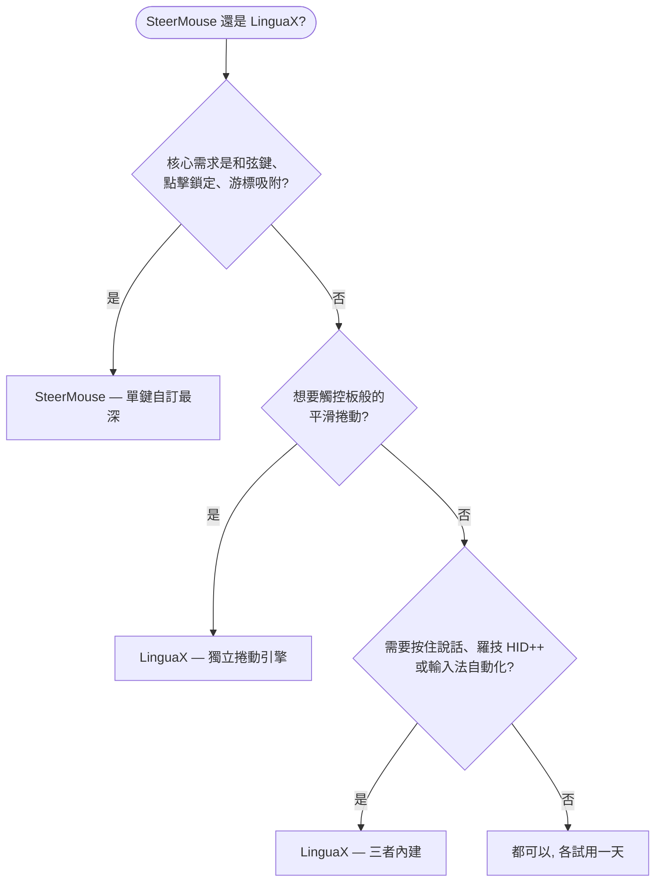

如果你在找 **SteerMouse 替代品**，先給你一個誠實的答案：SteerMouse 是 macOS 上最成熟的滑鼠工具之一——由日本開發商 Plentycom 自 2005 年維護至今，按鍵自訂深度屬於第一梯隊。而當你除了按鍵對應，還想要**真正的平滑捲動引擎、按住說話語音輸入、羅技硬體控制和輸入法自動切換**時，LinguaX 是更合適的選擇——而且價格更低。

## SteerMouse 做得好的地方

SteerMouse 專注於 USB 和藍牙滑鼠的深度驅動級自訂：

- 每個按鍵最多可指派 24 種功能，包括鍵盤快捷鍵、點擊（雙擊、點擊鎖定）、縮放、應用程式切換器、Mission Control、系統與音樂控制、開啟檔案或網址
- 和弦鍵（chording）——按鍵與修飾鍵、或按鍵與按鍵的組合
- 游標調節超越 macOS 滑桿：追蹤速度之外還有獨立的靈敏度控制，以及游標吸附（snapping）
- 捲動調節（加速度與靈敏度）和自動捲動
- 依應用程式單獨設定
- 「推薦設定」列表，可查看其他使用者分享的設定排行
- 大版本內買斷制——無訂閱

以上均有據可查，來自 [SteerMouse 官網](https://plentycom.jp/en/steermouse/)的公開功能說明。SteerMouse 不支援 Apple Magic Mouse 和 Magic Trackpad，部分特殊按鍵可能無法識別——這些正是 LinguaX 的目標裝置品類（第三方滑鼠）。

## LinguaX 的不同之處

LinguaX 在按鍵對應、快捷鍵、依應用程式設定上與 SteerMouse 重疊，但設計目標是覆蓋更完整的日常工作流：

- **真正的平滑捲動引擎**：SteerMouse 調節的是原生捲動事件的加速度與靈敏度；LinguaX 則把一格一格的滾輪步進替換為帶阻尼的連續曲線（Min Step / Speed Gain / Duration 三參數），並可依應用程式開關。
- **按住說話語音輸入**：按住滑鼠側鍵即可觸發 macOS 聽寫、Wispr Flow 或 superwhisper（透過 Fn/Globe 長按或快捷鍵對應）。
- **羅技硬體控制**：在受支援的型號上直接調節硬體 DPI、SmartShift、查看電量——無需安裝 Logi Options+。
- **輸入法自動切換**：依應用程式和網站網域自動切換 macOS 輸入法——完全在 SteerMouse 的功能範圍之外。
- **價格與升級**：SteerMouse 5 售價 $19.99，大版本升級需付費（從 v4 升級 $12.99）。LinguaX $9.9 一次買斷終身版，可啟用 3 台 Mac，後續更新免費。

如果你的核心需求是極致的單鍵自訂深度——和弦鍵、點擊鎖定、游標吸附——SteerMouse 可能就是對口的工具。如果你的工作流還涉及平滑捲動、語音輸入、羅技硬體特性或多語言輸入，LinguaX 的覆蓋面更廣。

## SteerMouse 與 LinguaX 對比

| 需求 | SteerMouse | LinguaX |
| --- | --- | --- |
| 按鍵自訂深度 | 每鍵最多 24 種功能 | 點擊 / 雙擊 / 長按 / 方向拖曳手勢 |
| 和弦鍵（鍵+鍵組合） | 支援 | 非主打能力 |
| 游標速度/靈敏度調節 | 支援，另有游標吸附 | 支援，依裝置記憶指標速度 |
| 平滑捲動（阻尼曲線） | 捲動加速度/靈敏度調節 | 支援，三參數調節，可依 App 開關 |
| 滑鼠滾輪方向獨立於觸控板 | 透過捲動設定實現 | 支援，垂直/水平分軸開關 |
| 依應用程式設定 | 支援 | 支援，App 級覆寫 |
| 羅技 DPI / SmartShift / 電量 | 非主打能力 | 支援（受支援型號） |
| 按住說話語音輸入 | 不支援 | 支援 |
| 輸入法依應用程式/網站切換 | 不支援 | 支援 |
| Magic Mouse / Trackpad 支援 | 不支援 | 面向第三方滑鼠 |
| 價格模式 | 30 天試用，$19.99/大版本（升級付費） | 30 天試用，$9.9 一次買斷，3 台 Mac |

## 快速決策

## 什麼情況下選 SteerMouse

- 你依賴和弦鍵（按鍵+按鍵、按鍵+修飾鍵組合）
- 你需要點擊鎖定、游標吸附，或單個按鍵承載最多 24 種功能
- 你看重 20 年持續維護的歷史積澱
- 你不需要平滑捲動、按住說話或輸入法自動化

## 什麼情況下選 LinguaX

- 滾輪一頓一頓是你最大的痛點——你要的是真正的平滑曲線，而不是更快的步進
- 你用羅技滑鼠，想在不裝 Logi Options+ 的情況下調 DPI、SmartShift、看電量
- 你想把側鍵變成聽寫應用的按住說話鍵
- 你用多種語言輸入，希望輸入法跟隨應用程式或網站網域自動切換
- 你想要買斷後永久免費更新，不為大版本升級再次付費

## 用你自己的滑鼠實測

兩款應用都有 30 天免費試用，最可靠的比較方式是拿真實裝置用一天：

1. 在兩款應用裡對應同一個側鍵。
2. 在瀏覽器和長文件裡對比捲動——這是兩種設計哲學差異最大的地方。
3. 讓 Mac 睡眠再喚醒，確認對應仍然生效。
4. 如果你用語音輸入或多輸入法，在 LinguaX 裡把這兩條流程也測一遍。

## 常見問題

**LinguaX 能直接替代 SteerMouse 嗎？**
對於常見需求——按鍵對應、快捷鍵、依應用程式設定、捲動調節——可以。如果你明確依賴 SteerMouse 的和弦鍵、點擊鎖定或游標吸附，那目前只有 SteerMouse 提供這些能力。

**哪款應用的平滑捲動更好？**
LinguaX。SteerMouse 調節捲動加速度與靈敏度，改變的是原生步進式捲動的「快慢感」；LinguaX 則把步進替換為連續的阻尼曲線，更接近觸控板。如果「捲動發跳」是你的痛點，這個差異就是全部關鍵。

**哪款應用更適合羅技滑鼠？**
如果你想要 DPI、SmartShift、電量顯示這類硬體特性，選 LinguaX。SteerMouse 在通用 HID 層面支援羅技滑鼠，按鍵自訂也很出色，但羅技專屬硬體控制不是它的目標。

**SteerMouse 還在維護嗎？**
在維護——目前是第 5 代版本，授權為大版本內買斷，跨大版本升級需付費。自 2005 年以來持續更新至今。

**應該先試哪一款？**
哪個痛點最痛就先試哪個。如果痛點是「我需要複雜的按鍵組合」，先試 SteerMouse；如果痛點是「捲動太難用，而且我希望滑鼠增強、語音輸入、輸入法自動化一個應用全包」，先試 LinguaX。

## 開始使用

LinguaX 免費下載，**30 天全功能試用**——無需帳號、零遙測。如果適合你的工作流，**$9.9 一次買斷終身版，可啟用 3 台 Mac**，無訂閱。

**[下載 LinguaX](/download)**，用你真實的滑鼠環境驗證。

## 相關指南

- [Mouse+ — macOS 滑鼠增強](/docs/mouse-plus/overview)
- [平滑捲動](/docs/mouse-plus/fundamentals/smooth-scrolling)
- [按鍵對應](/docs/mouse-plus/fundamentals/button-mapping)
- [Mos vs LinearMouse vs Mac Mouse Fix](/docs/comparisons/mos-vs-linearmouse-vs-mac-mouse-fix)
- [Logi Options+ 替代品](/docs/comparisons/logi-options-plus-alternative-macos)
- [USB Overdrive 替代品](/docs/comparisons/usb-overdrive-alternative-mac)
- [BetterTouchTool 替代品（滑鼠場景）](/docs/comparisons/bettertouchtool-alternative-for-mouse-mac)
