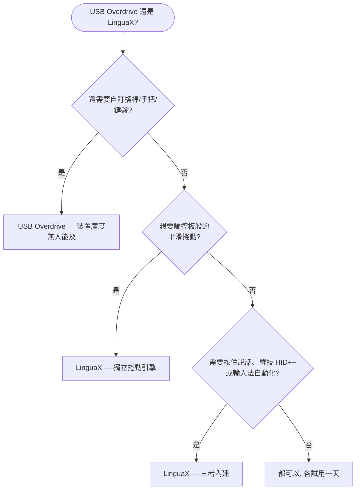

如果你在找 **USB Overdrive 替代品**，先給你一個誠實的答案：USB Overdrive 是 macOS 上的老牌工具——從 Mac OS 9 時代活到現在，裝置覆蓋面無人能及：滑鼠、鍵盤、軌跡球、搖桿、遊戲手把，幾乎任何廠商都行。而當你關注的就是**滑鼠**，還想要**真正的平滑捲動引擎、按住說話語音輸入、羅技硬體控制和輸入法自動切換**時，LinguaX 更合適——價格只有一半。

## USB Overdrive 做得好的地方

USB Overdrive 專注於通用、驅動級的輸入裝置自訂：

- 支援 USB 和藍牙的滑鼠、鍵盤、軌跡球、搖桿、遊戲手把，幾乎任何廠商——遊戲控制器支援在這個品類裡是稀缺能力
- 依裝置、依應用程式的按鍵和軸指派
- 滑鼠加速度與捲動速度自訂
- 分軸捲動反轉、按住修飾鍵交換捲動軸（5.3 版新增）
- 超長 macOS 相容記錄——5.3.1 支援從 macOS 12 Monterey 到 macOS 26 Tahoe，舊版本一路回溯幾十年
- 共享軟體模式：試用**永不過期**；$20 註冊費去除的是登入時和開啟設定時的 10 秒提醒窗

以上均有據可查，來自 [USB Overdrive 官網](https://www.usboverdrive.com/)。和 LinguaX 一樣，它刻意不支援 Apple 自家的滑鼠、觸控板和鍵盤——兩款應用都是為第三方硬體而生。

## LinguaX 的不同之處

LinguaX 在滑鼠的按鍵對應、依應用程式設定上與 USB Overdrive 重疊，但設計目標是覆蓋更完整的日常工作流：

- **真正的平滑捲動引擎**：USB Overdrive 調節的是原生步進捲動的速度與加速度；LinguaX 把一格一格的滾輪步進替換為帶阻尼的連續曲線（Min Step / Speed Gain / Duration 三參數），並可依應用程式開關。
- **按住說話語音輸入**：按住滑鼠側鍵即可觸發 macOS 聽寫、Wispr Flow 或 superwhisper。
- **羅技硬體控制**：在受支援的型號上直接調節硬體 DPI、SmartShift、查看電量——無需安裝 Logi Options+。
- **輸入法自動切換**：依應用程式和網站網域自動切換 macOS 輸入法——完全在 USB Overdrive 的功能範圍之外。
- **價格與試用方式**：USB Overdrive $20，試用永不過期但帶提醒窗；LinguaX 提供乾淨的 30 天全功能試用，之後 $9.9 一次買斷終身版，可啟用 3 台 Mac，後續更新免費。

如果你需要在滑鼠之外同時自訂搖桿、遊戲手把或鍵盤，USB Overdrive 的裝置廣度是 LinguaX 不去對標的能力。如果你的世界就是滑鼠——還涉及平滑捲動、語音輸入、羅技硬體特性或多語言輸入——LinguaX 的覆蓋面更廣。

## USB Overdrive 與 LinguaX 對比

| 需求 | USB Overdrive | LinguaX |
| --- | --- | --- |
| 滑鼠、鍵盤、軌跡球 | 支援 | 滑鼠（任意 USB/藍牙品牌） |
| 搖桿 / 遊戲手把 | 支援 | 不支援 |
| 按鍵自訂 | 依裝置、依應用程式指派 | 點擊 / 雙擊 / 長按 / 方向拖曳手勢，App 級覆寫 |
| 平滑捲動（阻尼曲線） | 捲動速度/加速度調節 | 支援，三參數調節，可依 App 開關 |
| 滑鼠滾輪方向獨立於觸控板 | 分軸反轉（5.3+） | 支援，垂直/水平分軸開關 |
| 依應用程式設定 | 支援 | 支援，App 級覆寫 |
| 羅技 DPI / SmartShift / 電量 | 非主打能力 | 支援（受支援型號） |
| 按住說話語音輸入 | 不支援 | 支援 |
| 輸入法依應用程式/網站切換 | 不支援 | 支援 |
| Apple 滑鼠/觸控板/鍵盤 | 不支援（刻意設計） | 面向第三方滑鼠 |
| 價格模式 | $20 共享軟體，無限試用帶提醒窗 | 30 天試用，$9.9 一次買斷，3 台 Mac |

## 快速決策

## 什麼情況下選 USB Overdrive

- 你需要自訂的不只是滑鼠——搖桿、遊戲手把、軌跡球、鍵盤都要管
- 你喜歡永不過期的共享軟體試用，不介意提醒窗
- 你看重一路回溯到經典 Mac OS 時代的相容記錄
- 你不需要平滑捲動、按住說話或輸入法自動化

## 什麼情況下選 LinguaX

- 滾輪一頓一頓是你最大的痛點——你要的是真正的平滑曲線，而不是更快的步進
- 你用羅技滑鼠，想在不裝 Logi Options+ 的情況下調 DPI、SmartShift、看電量
- 你想把側鍵變成聽寫應用的按住說話鍵
- 你用多種語言輸入，希望輸入法跟隨應用程式或網站網域自動切換
- 你想要乾淨的 30 天試用和永久免費更新，價格只要一半

## 用你自己的滑鼠實測

兩款應用都可以免費試用，最可靠的比較方式是拿真實裝置用一天：

1. 在兩款應用裡對應同一個側鍵。
2. 在瀏覽器和長文件裡對比捲動——這是兩種設計哲學差異最大的地方。
3. 讓 Mac 睡眠再喚醒，確認對應仍然生效。
4. 如果你用語音輸入或多輸入法，在 LinguaX 裡把這兩條流程也測一遍。

## 常見問題

**LinguaX 能直接替代 USB Overdrive 嗎？**
對滑鼠來說，大多數情況下可以——按鍵對應、依應用程式設定、捲動行為都覆蓋了，而且往往更深。對鍵盤、軌跡球、搖桿、遊戲手把則不行：USB Overdrive 的裝置廣度無人能及，LinguaX 也不試圖替代那部分。

**哪款應用的平滑捲動更好？**
LinguaX。USB Overdrive 調節捲動速度與加速度，改變的是原生步進式捲動的「快慢感」；LinguaX 則把步進替換為連續的阻尼曲線，更接近觸控板。如果「捲動發跳」是你的痛點，這個差異就是全部關鍵。

**哪款應用更適合羅技滑鼠？**
如果你想要 DPI、SmartShift、電量顯示這類硬體特性，選 LinguaX。USB Overdrive 在通用 HID 層面支援羅技滑鼠，但羅技專屬硬體控制不是它的目標。

**USB Overdrive 還在維護嗎？**
在維護——5.3.1 支援到最新的 macOS 26 Tahoe，5.3 版本還加入了分軸捲動反轉。自經典 Mac OS 時代持續維護至今。

**應該先試哪一款？**
哪個痛點最痛就先試哪個。如果痛點是「我要管好幾種輸入裝置」，先試 USB Overdrive；如果痛點是「捲動太難用，而且我希望滑鼠增強、語音輸入、輸入法自動化一個應用全包」，先試 LinguaX。

## 開始使用

LinguaX 免費下載，**30 天全功能試用**——無需帳號、零遙測。如果適合你的工作流，**$9.9 一次買斷終身版，可啟用 3 台 Mac**，無訂閱。

**[下載 LinguaX](/download)**，用你真實的滑鼠環境驗證。

## 相關指南

- [Mouse+ — macOS 滑鼠增強](/docs/mouse-plus/overview)
- [平滑捲動](/docs/mouse-plus/fundamentals/smooth-scrolling)
- [按鍵對應](/docs/mouse-plus/fundamentals/button-mapping)
- [SteerMouse 替代品](/docs/comparisons/steermouse-alternative-mac)
- [Logi Options+ 替代品](/docs/comparisons/logi-options-plus-alternative-macos)
- [BetterTouchTool 替代品（滑鼠場景）](/docs/comparisons/bettertouchtool-alternative-for-mouse-mac)
