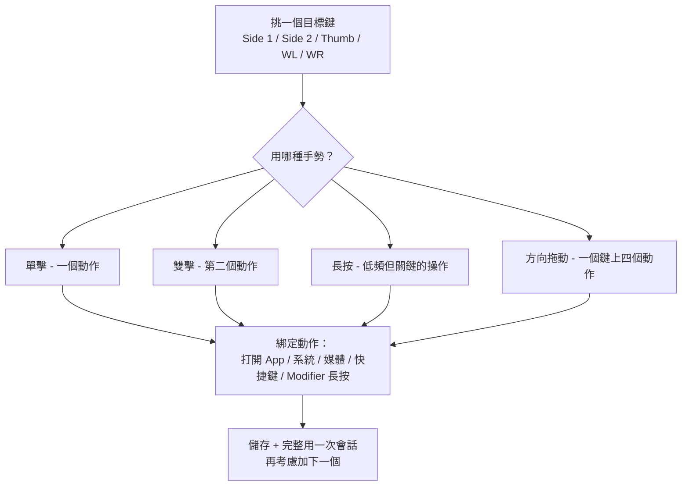

import ThemedImage from '@theme/ThemedImage';
import useBaseUrl from '@docusaurus/useBaseUrl';

# Mac 滑鼠側鍵怎麼映射：任意品牌滑鼠（無需驅動、無需帳號）

如果你把滑鼠接到 Mac 上，會發現**側鍵（拇指鍵、Side 1/2/3/4）什麼都做不了**，或者只能觸發一個固定動作、無法修改——因為 macOS 系統裡根本沒有給這些按鍵提供設定項。這篇是 **Mac 上映射滑鼠側鍵**的完整方法，覆蓋**任意品牌滑鼠**（羅技 MX Master、G502 X、M720、M585，以及非羅技滑鼠），不需要驅動、不需要註冊帳號。LinguaX 是原生 macOS 工具（約 10MB），能把側鍵、拇指鍵、滾輪左右傾按綁定到瀏覽器上一頁下一頁、Mission Control、媒體鍵、任意快捷鍵，甚至按住說話觸發語音輸入，還能分 App 獨立設定。

## LinguaX 能映射哪些鍵

- **Side（側鍵 1–4）** 和 **Thumb（拇指鍵）** ——識別到的型號自動出現
- **滾輪左右傾按（WL / WR）** ——裝置支援時可用，預設觸發水平捲動，只能綁定「點擊」這一種手勢
- 每個鍵支援的**手勢**：單擊、雙擊、**長按**、以及**方向拖動/滑動**（上/下/左/右）
- 可綁定的動作集：**系統預設**（Mission Control、切換 Space 等）、**媒體控制**、**鍵盤快捷鍵**、**Modifier 長按**、**打開 App**

LinguaX 自動識別常見型號（MX Master 系列、MX Anywhere、G502 X、M720、M585 等）並給出合理的預設映射，不識別的滑鼠也能用（手動逐鍵映射）。**提示**：**拇指鍵長按**僅在透過 HID++ 通道連接的羅技機型上可用；單擊/雙擊/方向拖動等手勢適用範圍更廣。

## 設定步驟

1. 安裝 LinguaX，首次執行時授予**輔助使用（Accessibility）**權限。
2. 打開 **Mouse+**，選中要映射的那個按鍵。
3. 選一個**手勢**（先從單擊開始）並綁定一個動作。
4. 儲存後，先用完整的一次工作會話，別急著加更多映射。

<ThemedImage
  alt={"LinguaX 滑鼠設定：選中 S1（側鍵 1）並綁定一個「單擊」動作"}
  sources={{
    light: useBaseUrl('/img/linguax-mouse-settings.png'),
    dark: useBaseUrl('/img/linguax-mouse-settings-dark.png'),
  }}
  width="420"
/>

## 推薦的映射順序

1. 先挑一個**真正高頻的動作**（瀏覽器上一頁、Mission Control、或某個 App 的快捷鍵）。
2. 只映射到一個側鍵，用一次完整會話感受一下。
3. 直到第一個映射用起來完全自然，再加第二個。

側鍵的**方向拖動**很強大：一個鍵最多能放四個方向的動作，拖動時螢幕上會即時提示當前指向哪個方向。

## 讓映射保持穩定

- 別在一個鍵上疊太多動作（超過 3 個手勢就很容易記混）
- 別在多個工具裡給同一個鍵做重疊映射（會互相打架）
- **分 App 覆寫**只在真的需要不同行為的 App 上用，其他地方保持全域一致

**每支連接的滑鼠獨立儲存自己的按鍵狀態**，第二隻滑鼠不會繼承第一隻的映射，也不會衝突。

## 幾個好用的第一映射

- 瀏覽器**上一頁 / 下一頁**
- **Mission Control** 或**切換 Space**
- 打開常用的**啟動器 / 命令列**
- 某個編輯器或設計工具裡**高頻重複的快捷鍵**

## 排錯快速自查

- 確認**輔助使用（Accessibility）**權限已授予
- 檢查沒有別的工具在給同一個按鍵做重疊映射
- 先只測**一個按鍵 + 一個手勢**，能用之後再加

## 常見問題

### 任何品牌滑鼠都能映射側鍵嗎？

能。任何 **USB 或藍牙滑鼠**都能用，不需要驅動。已識別的羅技型號（MX Master 2S/3/3S、MX Anywhere 系列、G502 X、M720、M585 等）額外享受預設映射；未識別的滑鼠手動逐鍵映射即可。

### 為什麼 Mac 上滑鼠側鍵預設什麼都做不了？

macOS 系統設定裡根本**沒有超出「左右鍵 + 滾輪」之外的按鍵設定項**。廠商的官方 App（Logi Options+、Razer Synapse）能補上這一塊，但通常要**註冊帳號**或者**裝一個常駐的重量級後台**。像 LinguaX 這類原生工具直接在系統輸入層做映射，不需要帳號也不需要那些後台。

### 要用 MX Master 系列，必須裝 Logi Options+ 嗎？

不用。LinguaX 直接透過 BLE HID++ 和 MX Master 2S/3/3S/4 通訊，可以映射所有按鍵，包括**拇指鍵、長按、方向拖動**這些手勢。詳見 [MX Master 3S 無需 Logi Options+ 也能設定](/docs/comparisons/mx-master-3s-mac-setup-without-logi-options)。

### 滑鼠按鍵在 Mac 上能長按嗎？

**側鍵長按**大多數滑鼠都能用；**拇指鍵長按**目前只在透過 HID++ 通道連接的羅技型號上可用。單擊、雙擊、方向拖動這些手勢的適用範圍更廣。

### 睡眠喚醒之後映射還在嗎？

在。藍牙滑鼠喚醒時會自動重新連線，關鍵輸入服務會在系統喚醒時重新整理，映射不需要重啟 App 就能繼續用。

## 開始使用

LinguaX 有 **30 天完整功能免費試用**，無需註冊。合用的話，是**一次性 9.9 美元、可授權 3 台裝置**，沒有訂閱。

**[下載 LinguaX](/download)**——30 天免費試一把側鍵映射。

## 按型號看側鍵佈局

在配某一支具體的滑鼠？下面這些型號頁是這篇教程的延伸——每一頁展示實際按鍵排佈和 LinguaX 的映射方式：

- [MX Master 4](/docs/mouse-plus/models/mx-master-4) —— S1 / S2 / T / SM / WL / WR **再加**新增的 Actions Ring（`AR`）
- [MX Master 3S](/docs/mouse-plus/models/mx-master-3s) 與 [MX Master 3](/docs/mouse-plus/models/mx-master-3) —— 完整七位佈局，含拇指滾輪
- [MX Anywhere 3S](/docs/mouse-plus/models/mx-anywhere-3s) / [MX Anywhere 3](/docs/mouse-plus/models/mx-anywhere-3) —— 便攜尺寸，S1 / S2 為主
- [Logitech G Pro X Superlight 2](/docs/mouse-plus/models/logitech-g-pro-x-superlight-2) / [G Pro X Superlight](/docs/mouse-plus/models/logitech-g-pro-x-superlight) —— 電競滑鼠，Mac 下兩個側鍵
- [Logi Lift](/docs/mouse-plus/models/logitech-lift) —— 垂直人體工學佈局
- [MX Ergo](/docs/mouse-plus/models/mx-ergo) —— 軌跡球，S1 / S2 可重映射

## 延伸閱讀

- [Mac 按住說話語音輸入（滑鼠側鍵觸發）](/docs/push-to-talk/push-to-talk-voice-typing-mac)
- [Mac 滑鼠增強對比：Mos vs LinearMouse vs Mac Mouse Fix](/docs/comparisons/mos-vs-linearmouse-vs-mac-mouse-fix)
- [Mouse+ 概覽](/docs/mouse-plus/overview)
- [按鍵映射詳解（英文）](/docs/mouse-plus/fundamentals/button-mapping)
- [手勢映射詳解（英文）](/docs/mouse-plus/fundamentals/gesture-mapping)
